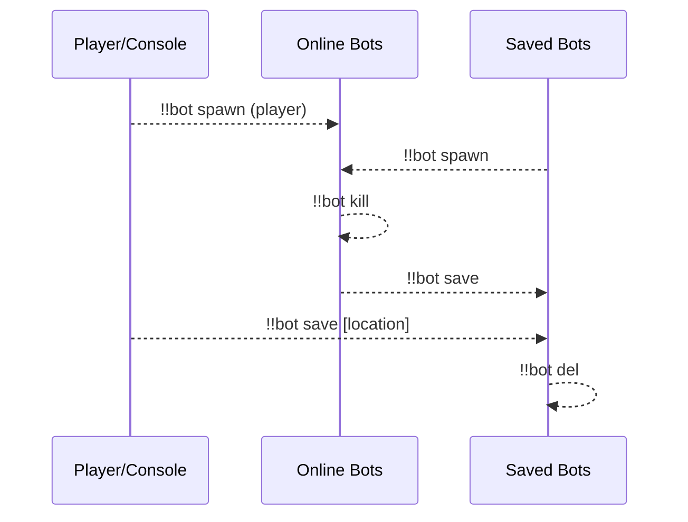
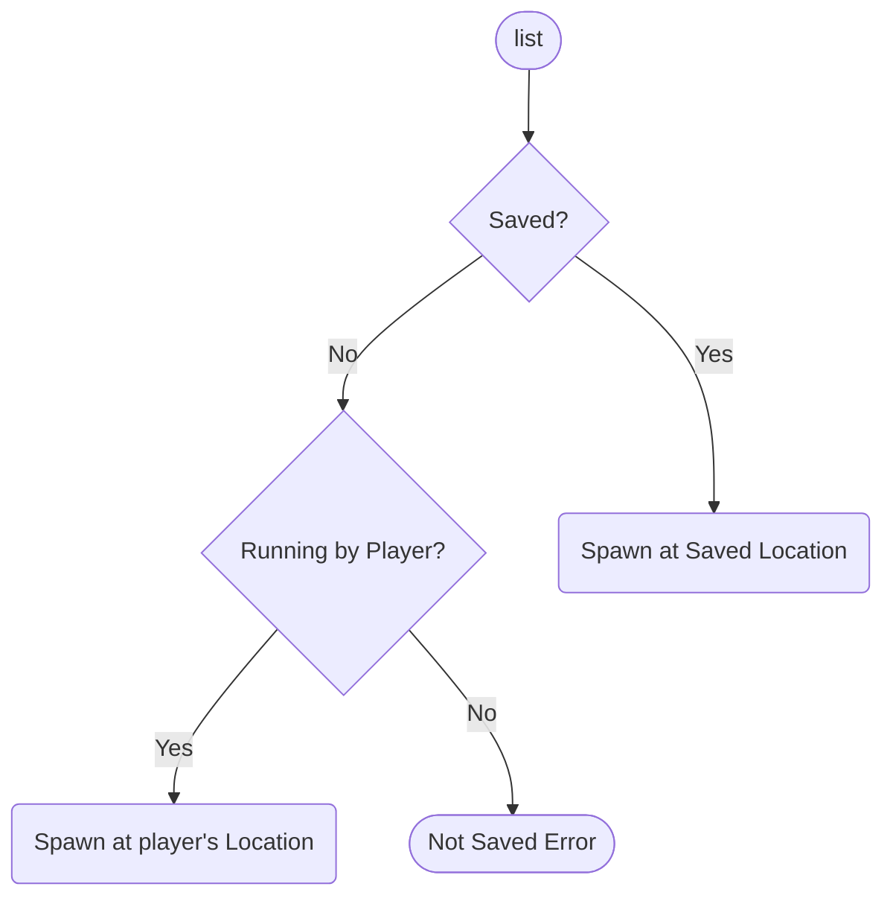
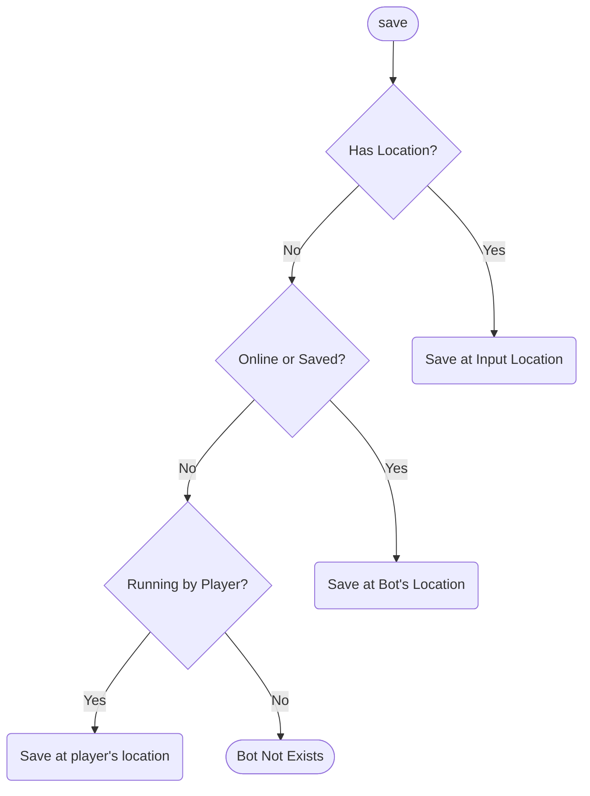
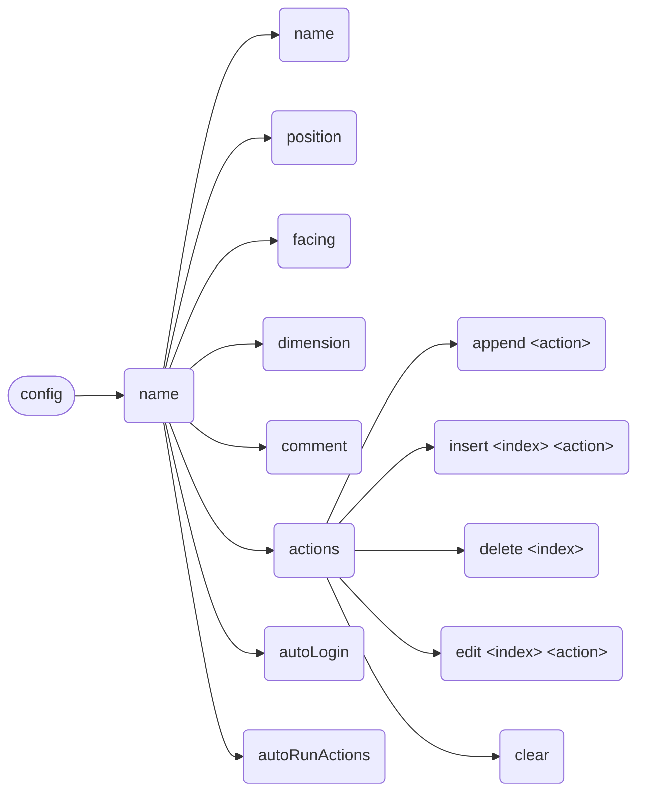
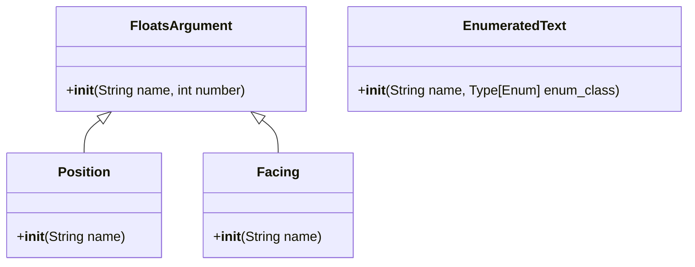

**English** | [中文](full-zh_cn.md)

\>\>\> [Back to index](/readme.md)

# Full Plugin Information Collection

Use `ctrl-f` to performance an in-page search, for what you are interested in

## advanced_calculator

### Basic Information

- Plugin ID: `advanced_calculator`
- Plugin Name: AdvancedCalculator
- Version: 0.2.1
  - Metadata version: 0.2.1
  - Release version: 0.2.1
- Total downloads: 175
- Authors: [Andy Zhang](https://github.com/AnzhiZhang)
- Repository: https://github.com/AnzhiZhang/MCDReforgedPlugins
- Labels: [`Tool`](/labels/tool/readme.md)
- Description: Provides multiple convenient in-game calculations

### Dependencies

| Plugin ID | Requirement |
| --- | --- |

### Requirements

| Python package | Requirement |
| --- | --- |

### Introduction

# AdvancedCalculator

> 提供游戏内多种便捷计算

## 使用

您可以使用 `=<expression>` 直接计算表达式

| 指令 | 用途 | 示例 | 结果 |
| - | - | - | - |
| !!calc \<expression> | 计算表达式 | !!calc 1+1 | 1+1=2 |
| !!calc item \<count> | 物品数转换堆叠数 | !!calc item 1794 | 1794个物品为1盒2组3个 |
| !!calc item \<box> \<stack> \<single> | 堆叠数转换物品数 | !!calc item 1 10 32 | 1盒10组32个为2400个物品 |
| !!calc color \<red> \<green> \<blue> | 10进制RGB转16进制 | !!calc color 255 0 255 | (255, 0, 255) -> #FF00FF |
| !!calc color \<#HEX> | 16十进制RGB转10进制 | !!calc color #00FF00 | #00FF00 -> (0, 255, 0) |

### Download

> :warning: Warning: Read the README file in plugin repository before using it.

| File | Version | Upload Time | Size | Downloads | Operations |
| --- | --- | --- | --- | --- | --- |
| [AdvancedCalculator-v0.2.1.mcdr](https://github.com/AnzhiZhang/MCDReforgedPlugins/releases/tag/advanced_calculator-v0.2.1) | 0.2.1 | 2022/07/21 13:20:06 | 2.38KB | 24 | [Download](https://github.com/AnzhiZhang/MCDReforgedPlugins/releases/download/advanced_calculator-v0.2.1/AdvancedCalculator-v0.2.1.mcdr) |
| [AdvancedCalculator-v0.2.0.mcdr](https://github.com/AnzhiZhang/MCDReforgedPlugins/releases/tag/advanced_calculator-v0.2.0) | 0.2.0 | 2022/07/18 11:47:23 | 2.27KB | 22 | [Download](https://github.com/AnzhiZhang/MCDReforgedPlugins/releases/download/advanced_calculator-v0.2.0/AdvancedCalculator-v0.2.0.mcdr) |
| [AdvancedCalculator-v0.1.0.mcdr](https://github.com/AnzhiZhang/MCDReforgedPlugins/releases/tag/advanced_calculator-0.1.0) | 0.1.0 | 2022/05/21 15:09:14 | 2.14KB | 129 | [Download](https://github.com/AnzhiZhang/MCDReforgedPlugins/releases/download/advanced_calculator-0.1.0/AdvancedCalculator-v0.1.0.mcdr) |

## advanced_whitelist_r

### Basic Information

- Plugin ID: `advanced_whitelist_r`
- Plugin Name: AdvancedWhitelistR
- Version: 1.0.2
  - Metadata version: 1.0.2
  - Release version: 1.0.2
- Total downloads: 104
- Authors: [noionion](https://github.com/2X-ercha)
- Repository: https://github.com/EMUnion/AdvancedWhitelistR
- Labels: [`Management`](/labels/management/readme.md)
- Description: For outline-model Whitelist

### Dependencies

| Plugin ID | Requirement |
| --- | --- |
| [mcdreforged](https://github.com/Fallen-Breath/MCDReforged) | \>=2.1.0 |

### Requirements

| Python package | Requirement |
| --- | --- |

### Introduction

Offline server whitelist management

### Download

> :warning: Warning: Read the README file in plugin repository before using it.

| File | Version | Upload Time | Size | Downloads | Operations |
| --- | --- | --- | --- | --- | --- |
| [AdvancedWhitelistR-v1.0.2.mcdr](https://github.com/EMUnion/AdvancedWhitelistR/releases/tag/1.0.2) | 1.0.2 | 2022/01/24 15:38:16 | 3.5KB | 103 | [Download](https://github.com/EMUnion/AdvancedWhitelistR/releases/download/1.0.2/AdvancedWhitelistR-v1.0.2.mcdr) |
| [AdvancedWhitelistR-v1.0.1.mcdr](https://github.com/EMUnion/AdvancedWhitelistR/releases/tag/1.0.1) | 1.0.1 | 2022/01/24 11:46:47 | 3.5KB | 1 | [Download](https://github.com/EMUnion/AdvancedWhitelistR/releases/download/1.0.1/AdvancedWhitelistR-v1.0.1.mcdr) |

## aluminum

### Basic Information

- Plugin ID: `aluminum`
- Plugin Name: Aluminum
- Version: 0.1.3
  - Metadata version: 0.1.3
  - Release version: N/A
- Total downloads: 0
- Authors: [Alex3236](https://github.com/alex3236)
- Repository: https://github.com/MCDReforged/Aluminum
- Labels: [`Management`](/labels/management/readme.md)
- Description: A MCDReforged plugin manager.

### Dependencies

| Plugin ID | Requirement |
| --- | --- |
| [mcdreforged](https://github.com/Fallen-Breath/MCDReforged) | \>=2.2.0 |

### Requirements

| Python package | Requirement |
| --- | --- |
| [mcdreforged](https://pypi.org/project/mcdreforged) | \>=2.0.1 |
| [requests](https://pypi.org/project/requests) |  |

### Introduction

A MCDR plugin manager.

:warning: **Read README in repository before use!**

### Download

> :warning: Warning: Read the README file in plugin repository before using it.

| File | Version | Upload Time | Size | Downloads | Operations |
| --- | --- | --- | --- | --- | --- |

## auto_plugin_reloader

### Basic Information

- Plugin ID: `auto_plugin_reloader`
- Plugin Name: Auto Plugin Reloader
- Version: 1.1.3
  - Metadata version: 1.1.3
  - Release version: 1.1.3
- Total downloads: 4231
- Authors: [Fallen_Breath](https://github.com/Fallen-Breath)
- Repository: https://github.com/TISUnion/AutoPluginReloader
- Labels: [`Management`](/labels/management/readme.md)
- Description: Automatically reload plugins when file changes

### Dependencies

| Plugin ID | Requirement |
| --- | --- |
| [mcdreforged](https://github.com/Fallen-Breath/MCDReforged) | \>=2.1.0-beta |

### Requirements

| Python package | Requirement |
| --- | --- |

### Introduction

It's a plugin that automatically detects changes made in the MCDR plugin folders and triggers plugin reload

It's a savior for lazy people who are tired of having to manually perform plugin reloads after plugin file updates!

### Download

> :warning: Warning: Read the README file in plugin repository before using it.

| File | Version | Upload Time | Size | Downloads | Operations |
| --- | --- | --- | --- | --- | --- |
| [AutoPluginReloader-v1.1.3.mcdr](https://github.com/TISUnion/AutoPluginReloader/releases/tag/v1.1.3) | 1.1.3 | 2021/10/01 18:23:47 | 17.58KB | 569 | [Download](https://github.com/TISUnion/AutoPluginReloader/releases/download/v1.1.3/AutoPluginReloader-v1.1.3.mcdr) |
| [AutoPluginReloader-v1.1.2.mcdr](https://github.com/TISUnion/AutoPluginReloader/releases/tag/v1.1.2) | 1.1.2 | 2021/09/30 10:02:54 | 17.59KB | 102 | [Download](https://github.com/TISUnion/AutoPluginReloader/releases/download/v1.1.2/AutoPluginReloader-v1.1.2.mcdr) |
| [AutoPluginReloader-v1.1.1.mcdr](https://github.com/TISUnion/AutoPluginReloader/releases/tag/v1.1.1) | 1.1.1 | 2021/09/12 10:20:17 | 17.47KB | 886 | [Download](https://github.com/TISUnion/AutoPluginReloader/releases/download/v1.1.1/AutoPluginReloader-v1.1.1.mcdr) |

## beep

### Basic Information

- Plugin ID: `beep`
- Plugin Name: Beep
- Version: 1.1.0
  - Metadata version: 1.1.0
  - Release version: 1.1.0
- Total downloads: 3411
- Authors: [Fallen_Breath](https://github.com/Fallen-Breath), [LucunJi](https://github.com/LucunJi)
- Repository: https://github.com/TISUnion/Beep
- Labels: [`Tool`](/labels/tool/readme.md)
- Description: Use @ \<someone\> to ping someone, @ all for everyone. Use @@ for a pogger ping

### Dependencies

| Plugin ID | Requirement |
| --- | --- |
| [mcdreforged](https://github.com/Fallen-Breath/MCDReforged) | \>=2.1.0 |

### Requirements

| Python package | Requirement |
| --- | --- |

### Introduction

*None*

### Download

> :warning: Warning: Read the README file in plugin repository before using it.

| File | Version | Upload Time | Size | Downloads | Operations |
| --- | --- | --- | --- | --- | --- |
| [Beep-v1.1.0.mcdr](https://github.com/TISUnion/Beep/releases/tag/v1.1.0) | 1.1.0 | 2021/08/26 14:01:49 | 1.74KB | 2087 | [Download](https://github.com/TISUnion/Beep/releases/download/v1.1.0/Beep-v1.1.0.mcdr) |
| [Beep-v1.0.0.mcdr](https://github.com/TISUnion/Beep/releases/tag/v1.0.0) | 1.0.0 | 2021/08/21 15:35:36 | 1.67KB | 1324 | [Download](https://github.com/TISUnion/Beep/releases/download/v1.0.0/Beep-v1.0.0.mcdr) |

## bingo

### Basic Information

- Plugin ID: `bingo`
- Plugin Name: Bingo
- Version: 0.0.2
  - Metadata version: 0.0.2
  - Release version: 0.0.2
- Total downloads: 32
- Authors: [Andy Zhang](https://github.com/AnzhiZhang)
- Repository: https://github.com/AnzhiZhang/MCDReforgedPlugins
- Labels: [`Tool`](/labels/tool/readme.md)
- Description: Useful tool for Bingo game

### Dependencies

| Plugin ID | Requirement |
| --- | --- |

### Requirements

| Python package | Requirement |
| --- | --- |

### Introduction

# Bingo

> [Bingo](https://www.flytre.net/bingo) 游戏实用工具

## 使用

| 指令 | 用途 |
| - | - |
| !!bingo team \<num> | 随机分组 |
| !!bingo end | 结束游戏 |

### Download

> :warning: Warning: Read the README file in plugin repository before using it.

| File | Version | Upload Time | Size | Downloads | Operations |
| --- | --- | --- | --- | --- | --- |
| [Bingo-v0.0.2.mcdr](https://github.com/AnzhiZhang/MCDReforgedPlugins/releases/tag/bingo-0.0.2) | 0.0.2 | 2022/06/16 14:14:47 | 1.31KB | 17 | [Download](https://github.com/AnzhiZhang/MCDReforgedPlugins/releases/download/bingo-0.0.2/Bingo-v0.0.2.mcdr) |
| [Bingo-v0.0.1.mcdr](https://github.com/AnzhiZhang/MCDReforgedPlugins/releases/tag/bingo-0.0.1) | 0.0.1 | 2022/06/16 12:57:06 | 1.31KB | 15 | [Download](https://github.com/AnzhiZhang/MCDReforgedPlugins/releases/download/bingo-0.0.1/Bingo-v0.0.1.mcdr) |

## bot

### Basic Information

- Plugin ID: `bot`
- Plugin Name: Bot
- Version: 1.0.2
  - Metadata version: 1.0.2
  - Release version: 1.0.2
- Total downloads: 127
- Authors: [Andy Zhang](https://github.com/AnzhiZhang)
- Repository: https://github.com/AnzhiZhang/MCDReforgedPlugins
- Labels: [`Tool`](/labels/tool/readme.md), [`Management`](/labels/management/readme.md)
- Description: The best carpet bot manager!

### Dependencies

| Plugin ID | Requirement |
| --- | --- |
| [mcdreforged](https://github.com/Fallen-Breath/MCDReforged) | ^2.5 |
| [minecraft_data_api](/plugins/minecraft_data_api/readme.md) | ^1.4 |
| [more_command_nodes](/plugins/more_command_nodes/readme.md) | ^1.1.0 |

### Requirements

| Python package | Requirement |
| --- | --- |

### Introduction

# Bot

> 最好用的地毯模组假人管理器！

## 依赖

- [MinecraftDataAPI](https://github.com/MCDReforged/MinecraftDataAPI)
- [MoreCommandNodes](https://github.com/AnzhiZhang/MCDReforgedPlugins/tree/master/more_command_nodes)

## 使用方法

`!!bot` 查看帮助

`!!bot list [index] [filter]` 显示假人列表

`!!bot spawn <name>` 上线假人

`!!bot kill <name>` 下线假人

`!!bot action [index]` 执行假人动作

`!!bot info <name>` 查看假人信息

`!!bot save <name> [position] [facing] [dimension]` 保存假人

`!!bot del <name>` 删除保存的假人

`!!bot config <name> <option> <value>` 配置假人



### list

**index**：列表的页码

**filter**：可用选项为：`--all`、`--online` 或 `--saved`，过滤假人

### spawn

上线假人



### kill

下线假人

### action

执行假人动作

当指定 `index` 时，执行特定动作而不是全部动作

### info

查看假人信息

### save

保存假人



### del

删除保存的假人

### config

配置假人



## 配置

### gamemode

默认值: `survival`

生成假人的游戏模式

### name_prefix

默认值：无

假人名称前缀

### name_suffix

默认值：无

假人名称前缀

### permissions

使用对应指令的最低权限

### Download

> :warning: Warning: Read the README file in plugin repository before using it.

| File | Version | Upload Time | Size | Downloads | Operations |
| --- | --- | --- | --- | --- | --- |
| [Bot-v1.0.2.mcdr](https://github.com/AnzhiZhang/MCDReforgedPlugins/releases/tag/bot-v1.0.2) | 1.0.2 | 2022/07/22 02:16:19 | 13.06KB | 47 | [Download](https://github.com/AnzhiZhang/MCDReforgedPlugins/releases/download/bot-v1.0.2/Bot-v1.0.2.mcdr) |
| [Bot-v1.0.1.mcdr](https://github.com/AnzhiZhang/MCDReforgedPlugins/releases/tag/bot-v1.0.1) | 1.0.1 | 2022/07/21 05:06:17 | 13.06KB | 11 | [Download](https://github.com/AnzhiZhang/MCDReforgedPlugins/releases/download/bot-v1.0.1/Bot-v1.0.1.mcdr) |
| [Bot-v1.0.0.mcdr](https://github.com/AnzhiZhang/MCDReforgedPlugins/releases/tag/bot-v1.0.0) | 1.0.0 | 2022/07/21 03:53:18 | 13.05KB | 6 | [Download](https://github.com/AnzhiZhang/MCDReforgedPlugins/releases/download/bot-v1.0.0/Bot-v1.0.0.mcdr) |

## bot_plugin

### Basic Information

- Plugin ID: `bot_plugin`
- Plugin Name: Bot Plugin
- Version: 1.0.0
  - Metadata version: 1.0.0
  - Release version: 1.0.0
- Total downloads: 227
- Authors: [DancingSnow0517](https://github.com/DancingSnow0517)
- Repository: https://github.com/DancingSnow0517/Bot_Manager
- Labels: [`Management`](/labels/management/readme.md), [`Tool`](/labels/tool/readme.md)
- Description: 管理 carpet 机器人

### Dependencies

| Plugin ID | Requirement |
| --- | --- |
| [mcdreforged](https://github.com/Fallen-Breath/MCDReforged) | \>=2.3.0 |
| [minecraft_data_api](/plugins/minecraft_data_api/readme.md) | \>=1.4.0 |

### Requirements

| Python package | Requirement |
| --- | --- |

### Introduction

# A MCDR bot manager。

:warning: **Read README in repository before use!**
### Download

> :warning: Warning: Read the README file in plugin repository before using it.

| File | Version | Upload Time | Size | Downloads | Operations |
| --- | --- | --- | --- | --- | --- |
| [BotPlugin-v1.0.0.mcdr](https://github.com/DancingSnow0517/Bot_Manager/releases/tag/1.0.0) | 1.0.0 | 2022/01/09 04:38:06 | 17.24KB | 227 | [Download](https://github.com/DancingSnow0517/Bot_Manager/releases/download/1.0.0/BotPlugin-v1.0.0.mcdr) |

## carpet_bot_manager

### Basic Information

- Plugin ID: `carpet_bot_manager`
- Plugin Name: Carpet Bot Manager
- Version: 0.3.0
  - Metadata version: 0.3.0
  - Release version: 0.3.0
- Total downloads: 1502
- Authors: [YehowahLiu](https://github.com/YehowahLiu)
- Repository: https://github.com/FAS-Server/CarpetBotManager
- Labels: [`Tool`](/labels/tool/readme.md)
- Description: A carpet bot manage plugin, able to spawn bot and make it execute actions

### Dependencies

| Plugin ID | Requirement |
| --- | --- |
| [mcdreforged](https://github.com/Fallen-Breath/MCDReforged) | \>=2.1.2 |
| [minecraft_data_api](/plugins/minecraft_data_api/readme.md) | \>=1.4.0 |

### Requirements

| Python package | Requirement |
| --- | --- |
| [mcdreforged](https://pypi.org/project/mcdreforged) | \>=2.1.2 |

### Introduction

A carpet bot manage plugin, able to spawn bot and make it execute actions

### Download

> :warning: Warning: Read the README file in plugin repository before using it.

| File | Version | Upload Time | Size | Downloads | Operations |
| --- | --- | --- | --- | --- | --- |
| [CarpetBotManager-v0.3.0.mcdr](https://github.com/FAS-Server/CarpetBotManager/releases/tag/v0.3.0) | 0.3.0 | 2021/09/07 17:13:43 | 9.93KB | 1502 | [Download](https://github.com/FAS-Server/CarpetBotManager/releases/download/v0.3.0/CarpetBotManager-v0.3.0.mcdr) |

## carpet_tick

### Basic Information

- Plugin ID: `carpet_tick`
- Plugin Name: Carpet Tick
- Version: 1.1.0
  - Metadata version: 1.1.0
  - Release version: 1.1.0
- Total downloads: 74
- Authors: [Ivan1F](https://github.com/Ivan-1F)
- Repository: https://github.com/Ivan-1F/CarpetTick
- Labels: [`Information`](/labels/information/readme.md)
- Description: Get server status using carpet /tick command

### Dependencies

| Plugin ID | Requirement |
| --- | --- |
| [mcdreforged](https://github.com/Fallen-Breath/MCDReforged) | \>=2.1.0-beta |

### Requirements

| Python package | Requirement |
| --- | --- |

### Introduction

*None*

### Download

> :warning: Warning: Read the README file in plugin repository before using it.

| File | Version | Upload Time | Size | Downloads | Operations |
| --- | --- | --- | --- | --- | --- |
| [CarpetTick-v1.1.0.mcdr](https://github.com/Ivan-1F/CarpetTick/releases/tag/v1.1.0) | 1.1.0 | 2022/04/07 09:28:18 | 3.48KB | 62 | [Download](https://github.com/Ivan-1F/CarpetTick/releases/download/v1.1.0/CarpetTick-v1.1.0.mcdr) |
| [CarpetTick-v1.0.0.mcdr](https://github.com/Ivan-1F/CarpetTick/releases/tag/v1.0.0) | 1.0.0 | 2022/03/11 14:50:05 | 3.35KB | 12 | [Download](https://github.com/Ivan-1F/CarpetTick/releases/download/v1.0.0/CarpetTick-v1.0.0.mcdr) |

## carpetbotlist

### Basic Information

- Plugin ID: `carpetbotlist`
- Plugin Name: CarpetBotList
- Version: 2.1.1
  - Metadata version: 2.1.1
  - Release version: 2.1.1
- Total downloads: 4252
- Authors: [ZeroKelvin](https://github.com/BelowZeroKelvin)
- Repository: https://github.com/BelowZeroKelvin/MCDR-CarpetBotList
- Labels: [`Tool`](/labels/tool/readme.md)
- Description: Help you manage your carpet fake player

### Dependencies

| Plugin ID | Requirement |
| --- | --- |
| [mcdreforged](https://github.com/Fallen-Breath/MCDReforged) | ^2.0.0-beta.1 |
| [minecraft_data_api](/plugins/minecraft_data_api/readme.md) | * |

### Requirements

| Python package | Requirement |
| --- | --- |

### Introduction

Help you manage your carpet fake player

### Download

> :warning: Warning: Read the README file in plugin repository before using it.

| File | Version | Upload Time | Size | Downloads | Operations |
| --- | --- | --- | --- | --- | --- |
| [CarpetBotList-v2.1.1.mcdr](https://github.com/BelowZeroKelvin/MCDR-CarpetBotList/releases/tag/v2.1.1) | 2.1.1 | 2021/08/23 06:17:05 | 1.89KB | 1614 | [Download](https://github.com/BelowZeroKelvin/MCDR-CarpetBotList/releases/download/v2.1.1/CarpetBotList-v2.1.1.mcdr) |
| [CarpetBotList-v2.1.0.mcdr](https://github.com/BelowZeroKelvin/MCDR-CarpetBotList/releases/tag/v2.1.0) | 2.1.0 | 2021/08/16 11:33:40 | 4.08KB | 1316 | [Download](https://github.com/BelowZeroKelvin/MCDR-CarpetBotList/releases/download/v2.1.0/CarpetBotList-v2.1.0.mcdr) |
| [CarpetBotList-v2.0.0.mcdr](https://github.com/BelowZeroKelvin/MCDR-CarpetBotList/releases/tag/v2.0.0) | 2.0.0 | 2021/08/12 07:45:32 | 3.6KB | 1322 | [Download](https://github.com/BelowZeroKelvin/MCDR-CarpetBotList/releases/download/v2.0.0/CarpetBotList-v2.0.0.mcdr) |

## cato

### Basic Information

- Plugin ID: `cato`
- Plugin Name: Cato Plugin
- Version: 1.1.0
  - Metadata version: 1.1.0
  - Release version: 1.1.0
- Total downloads: 411
- Authors: [Harry-zklcdc](https://github.com/Harry-zklcdc)
- Repository: https://github.com/Harry-zklcdc/MCDR-Cato
- Labels: [`Tool`](/labels/tool/readme.md)
- Description: Plugin Cato

### Dependencies

| Plugin ID | Requirement |
| --- | --- |
| [mcdreforged](https://github.com/Fallen-Breath/MCDReforged) | \>=2.0.0-alpha.1 |

### Requirements

| Python package | Requirement |
| --- | --- |

### Introduction

When the server starts, it automatically uses Cato (P2P connection tool) for port mapping, and supports the generation of HMCL Multiplayer code

# Features:

- Cato official support
- Non inductive P2P connection
- HMCL Multiplayer Support
- Cato crash / temporary ID expires restart automatically
- API interface to obtain Cato connection ID and HMCL Multiplayer code
- Cato token hot replacement
- Get Cato connection ID and HMCL Multiplayer code in the game

### Download

> :warning: Warning: Read the README file in plugin repository before using it.

| File | Version | Upload Time | Size | Downloads | Operations |
| --- | --- | --- | --- | --- | --- |
| [Cato-v1.1.0.mcdr](https://github.com/Harry-zklcdc/MCDR-Cato/releases/tag/cato-v1.1.0) | 1.1.0 | 2021/10/31 08:31:03 | 2.9KB | 379 | [Download](https://github.com/Harry-zklcdc/MCDR-Cato/releases/download/cato-v1.1.0/Cato-v1.1.0.mcdr) |
| [Cato-v1.0.0.mcdr](https://github.com/Harry-zklcdc/MCDR-Cato/releases/tag/cato-v1.0.0) | 1.0.0 | 2021/10/14 12:15:08 | 2.93KB | 32 | [Download](https://github.com/Harry-zklcdc/MCDR-Cato/releases/download/cato-v1.0.0/Cato-v1.0.0.mcdr) |

## chatbridge

### Basic Information

- Plugin ID: `chatbridge`
- Plugin Name: ChatBridge v2 for MCDR
- Version: 2.2.0
  - Metadata version: 2.2.0
  - Release version: 2.2.0
- Total downloads: 704
- Authors: [Fallen_Breath](https://github.com/Fallen-Breath)
- Repository: https://github.com/TISUnion/ChatBridge
- Labels: [`Tool`](/labels/tool/readme.md)
- Description: Broadcast chats between Minecraft servers and more

### Dependencies

| Plugin ID | Requirement |
| --- | --- |
| [mcdreforged](https://github.com/Fallen-Breath/MCDReforged) | \>=2.2.0- |

### Requirements

| Python package | Requirement |
| --- | --- |
| [mcdreforged](https://pypi.org/project/mcdreforged) | \>=2.2.0 |
| [pycryptodome](https://pypi.org/project/pycryptodome) |  |
| [colorlog](https://pypi.org/project/colorlog) |  |

### Introduction

Chatbridge v2

### Download

> :warning: Warning: Read the README file in plugin repository before using it.

| File | Version | Upload Time | Size | Downloads | Operations |
| --- | --- | --- | --- | --- | --- |
| [ChatBridge.pyz](https://github.com/TISUnion/ChatBridge/releases/tag/v2.2.0) | 2.2.0 | 2022/03/10 06:23:41 | 40.57KB | 299 | [Download](https://github.com/TISUnion/ChatBridge/releases/download/v2.2.0/ChatBridge.pyz) |
| [ChatBridge.pyz](https://github.com/TISUnion/ChatBridge/releases/tag/v2.1.1) | 2.1.1 | 2022/03/05 06:56:57 | 39.94KB | 17 | [Download](https://github.com/TISUnion/ChatBridge/releases/download/v2.1.1/ChatBridge.pyz) |
| [ChatBridge.pyz](https://github.com/TISUnion/ChatBridge/releases/tag/v2.1.0) | 2.1.0 | 2021/11/16 11:27:38 | 39.88KB | 186 | [Download](https://github.com/TISUnion/ChatBridge/releases/download/v2.1.0/ChatBridge.pyz) |

## chatbridgereforged_mc

### Basic Information

- Plugin ID: `chatbridgereforged_mc`
- Plugin Name: ChatBridgeReforged_MC
- Version: 0.2.5
  - Metadata version: 0.2.5-dev030
  - Release version: 0.2.5
- Total downloads: 39
- Authors: [Ricky](https://github.com/R1ckyH)
- Repository: https://github.com/R1ckyH/ChatBridgeReforged
- Labels: [`Tool`](/labels/tool/readme.md)
- Description: Reforged of ChatBridge, interaction with other clients(such as minecraft server, discord bots or other custom clients).

### Dependencies

| Plugin ID | Requirement |
| --- | --- |
| [mcdreforged](https://github.com/Fallen-Breath/MCDReforged) | \>=2.0.0 |

### Requirements

| Python package | Requirement |
| --- | --- |
| [mcdreforged](https://pypi.org/project/mcdreforged) |  |
| [pycryptodomex](https://pypi.org/project/pycryptodomex) |  |

### Introduction

Reforged of ChatBridge, interaction with other clients(such as minecraft server, discord bot or other things).

### Download

> :warning: Warning: Read the README file in plugin repository before using it.

| File | Version | Upload Time | Size | Downloads | Operations |
| --- | --- | --- | --- | --- | --- |
| [ChatBridgeReforged_MC.pyz](https://github.com/R1ckyH/ChatBridgeReforged/releases/tag/0.2.5) | 0.2.5 | 2022/07/15 17:07:36 | 68.82KB | 15 | [Download](https://github.com/R1ckyH/ChatBridgeReforged/releases/download/0.2.5/ChatBridgeReforged_MC.pyz) |
| [ChatBridgeReforged_MC.pyz](https://github.com/R1ckyH/ChatBridgeReforged/releases/tag/0.1.1) | 0.1.1 | 2022/03/04 06:12:36 | 46.96KB | 16 | [Download](https://github.com/R1ckyH/ChatBridgeReforged/releases/download/0.1.1/ChatBridgeReforged_MC.pyz) |
| [ChatBridgeReforged_MC.pyz](https://github.com/R1ckyH/ChatBridgeReforged/releases/tag/0.0.2) | 0.0.2 | 2022/01/15 16:33:44 | 44.9KB | 8 | [Download](https://github.com/R1ckyH/ChatBridgeReforged/releases/download/0.0.2/ChatBridgeReforged_MC.pyz) |

## colored_chat

### Basic Information

- Plugin ID: `colored_chat`
- Plugin Name: ColoredChat
- Version: 0.0.2
  - Metadata version: 0.0.2
  - Release version: 0.0.2
- Total downloads: 1520
- Authors: [Andy Zhang](https://github.com/AnzhiZhang)
- Repository: https://github.com/AnzhiZhang/MCDReforgedPlugins
- Labels: [`Tool`](/labels/tool/readme.md)
- Description: Support formatting codes for vanilla

### Dependencies

| Plugin ID | Requirement |
| --- | --- |

### Requirements

| Python package | Requirement |
| --- | --- |

### Introduction

# ColoredChat

> 支持原版显示 [格式化代码](https://minecraft.fandom.com/zh/wiki/%E6%A0%BC%E5%BC%8F%E5%8C%96%E4%BB%A3%E7%A0%81)

## 使用

与正常聊天没有区别, 需要格式化时使用 `&` 符号

## 配置

`force_refresh`

是否刷新聊天栏的所有内容, 某些无法被记录的信息可能会被覆盖

默认值: `True`

## API

可以使用 `append_msg(msg)` 方法来插件的广播消息

### Download

> :warning: Warning: Read the README file in plugin repository before using it.

| File | Version | Upload Time | Size | Downloads | Operations |
| --- | --- | --- | --- | --- | --- |
| [ColoredChat-v0.0.2.mcdr](https://github.com/AnzhiZhang/MCDReforgedPlugins/releases/tag/colored_chat-v0.0.2) | 0.0.2 | 2021/08/23 10:20:29 | 1.54KB | 1520 | [Download](https://github.com/AnzhiZhang/MCDReforgedPlugins/releases/download/colored_chat-v0.0.2/ColoredChat-v0.0.2.mcdr) |

## cpu_temp

### Basic Information

- Plugin ID: `cpu_temp`
- Plugin Name: cpu_temp
- Version: 3.0.2
  - Metadata version: 3.0.2
  - Release version: 3.0.2
- Total downloads: 154
- Authors: [Ricky](https://github.com/R1ckyH)
- Repository: https://github.com/R1ckyH/cpu_temp
- Labels: [`Information`](/labels/information/readme.md)
- Description: A plugin to check cpu temp regularly.

### Dependencies

| Plugin ID | Requirement |
| --- | --- |
| [mcdreforged](https://github.com/Fallen-Breath/MCDReforged) | \>=2.0.0 |

### Requirements

| Python package | Requirement |
| --- | --- |
| [psutil](https://pypi.org/project/psutil) |  |
| [mcdreforged](https://pypi.org/project/mcdreforged) |  |
| [APScheduler](https://pypi.org/project/APScheduler) |  |

### Introduction

A plugin to check cpu temp regularly.

### Download

> :warning: Warning: Read the README file in plugin repository before using it.

| File | Version | Upload Time | Size | Downloads | Operations |
| --- | --- | --- | --- | --- | --- |
| [cpu_temp-3.0.2.mcdr](https://github.com/R1ckyH/cpu_temp/releases/tag/v3.0.2) | 3.0.2 | 2021/10/26 07:30:51 | 8.42KB | 154 | [Download](https://github.com/R1ckyH/cpu_temp/releases/download/v3.0.2/cpu_temp-3.0.2.mcdr) |

## crash_restart

### Basic Information

- Plugin ID: `crash_restart`
- Plugin Name: Crash Restart
- Version: 1.0.0
  - Metadata version: 1.0.0
  - Release version: 1.0.0
- Total downloads: 2124
- Authors: [Fallen_Breath](https://github.com/Fallen-Breath)
- Repository: https://github.com/MCDReforged/CrashRestart
- Labels: [`Tool`](/labels/tool/readme.md)
- Description: Automatically restart the server after the server crashed

### Dependencies

| Plugin ID | Requirement |
| --- | --- |

### Requirements

| Python package | Requirement |
| --- | --- |

### Introduction

*None*

### Download

> :warning: Warning: Read the README file in plugin repository before using it.

| File | Version | Upload Time | Size | Downloads | Operations |
| --- | --- | --- | --- | --- | --- |
| [CrashRestart-v1.0.0.mcdr](https://github.com/MCDReforged/CrashRestart/releases/tag/v1.0.0) | 1.0.0 | 2021/08/22 04:31:25 | 13.33KB | 2124 | [Download](https://github.com/MCDReforged/CrashRestart/releases/download/v1.0.0/CrashRestart-v1.0.0.mcdr) |

## database_api

### Basic Information

- Plugin ID: `database_api`
- Plugin Name: DatabaseAPI
- Version: 0.1.1
  - Metadata version: 0.1.1
  - Release version: 0.1.1
- Total downloads: 23
- Authors: [Andy Zhang](https://github.com/AnzhiZhang)
- Repository: https://github.com/AnzhiZhang/MCDReforgedPlugins
- Labels: [`API`](/labels/api/readme.md)
- Description: Database API to access database

### Dependencies

| Plugin ID | Requirement |
| --- | --- |

### Requirements

| Python package | Requirement |
| --- | --- |
| [sqlalchemy](https://pypi.org/project/sqlalchemy) |  |

### Introduction

# DatabaseAPI

> 数据库API
>
> 提供了数据库操作的便捷API

## 环境要求

### Python包

- sqlalchemy

## 开发文档

查看 [Valut](https://github.com/AnzhiZhang/MCDReforgedPlugins/tree/master/.archived/vault/vault.py) 参考使用方法

提供了以下两个类:

- TableBase
- DataManager

### TableBase

一个数据库表的基类, 写一个你的数据库表并继承这个类来创建一张表

### DataManager

使用本API需要自行实例化这个类

实例化: `__init__(self, file_path: str)`

#### get_session

获取一个数据库会话的上下文管理器, 更多信息请自行查找资料

### Download

> :warning: Warning: Read the README file in plugin repository before using it.

| File | Version | Upload Time | Size | Downloads | Operations |
| --- | --- | --- | --- | --- | --- |
| [DatabaseAPI-v0.1.1.mcdr](https://github.com/AnzhiZhang/MCDReforgedPlugins/releases/tag/database_api-v0.1.1) | 0.1.1 | 2022/06/30 06:31:33 | 1.25KB | 22 | [Download](https://github.com/AnzhiZhang/MCDReforgedPlugins/releases/download/database_api-v0.1.1/DatabaseAPI-v0.1.1.mcdr) |
| [DatabaseAPI-v0.1.0.mcdr](https://github.com/AnzhiZhang/MCDReforgedPlugins/releases/tag/database_api-v0.1.0) | 0.1.0 | 2022/06/30 04:17:28 | 1.13KB | 1 | [Download](https://github.com/AnzhiZhang/MCDReforgedPlugins/releases/download/database_api-v0.1.0/DatabaseAPI-v0.1.0.mcdr) |

## daycount_nbt

### Basic Information

- Plugin ID: `daycount_nbt`
- Plugin Name: DayCount NBT
- Version: 2.2.0
  - Metadata version: 2.2.0
  - Release version: 2.2.0
- Total downloads: 4527
- Authors: [Alex3236](https://github.com/alex3236)
- Repository: https://github.com/alex3236/daycount-NBT
- Labels: [`Information`](/labels/information/readme.md), [`API`](/labels/api/readme.md)
- Description: :calendar: Get and export server opening times.

### Dependencies

| Plugin ID | Requirement |
| --- | --- |
| [mcdreforged](https://github.com/Fallen-Breath/MCDReforged) | \>=2.2.0 |

### Requirements

| Python package | Requirement |
| --- | --- |
| [nbtlib](https://pypi.org/project/nbtlib) | \>=2.0.0 |

### Introduction

Get and export server opening times.

Feature:
- NBT Mode

:warning: **Read README in repository before use!**
### Download

> :warning: Warning: Read the README file in plugin repository before using it.

| File | Version | Upload Time | Size | Downloads | Operations |
| --- | --- | --- | --- | --- | --- |
| [DayCountNBT-v2.2.0.mcdr](https://github.com/alex3236/daycount-NBT/releases/tag/v2.2.0) | 2.2.0 | 2022/01/10 04:14:00 | 1.58KB | 594 | [Download](https://github.com/alex3236/daycount-NBT/releases/download/v2.2.0/DayCountNBT-v2.2.0.mcdr) |
| [DayCountNBT-v2.1.1.mcdr](https://github.com/alex3236/daycount-NBT/releases/tag/v2.1.1) | 2.1.1 | 2021/11/08 14:26:50 | 1.33KB | 142 | [Download](https://github.com/alex3236/daycount-NBT/releases/download/v2.1.1/DayCountNBT-v2.1.1.mcdr) |
| [DayCountNBT-v2.1.0.mcdr](https://github.com/alex3236/daycount-NBT/releases/tag/v2.1) | 2.1 | 2021/10/01 06:12:46 | 1.31KB | 145 | [Download](https://github.com/alex3236/daycount-NBT/releases/download/v2.1/DayCountNBT-v2.1.0.mcdr) |

## daytime

### Basic Information

- Plugin ID: `daytime`
- Plugin Name: Daytime
- Version: 1.1.0
  - Metadata version: 1.1.0
  - Release version: 1.1.0
- Total downloads: 1578
- Authors: [ZeroKelvin](https://github.com/BelowZeroKelvin)
- Repository: https://github.com/BelowZeroKelvin/MCDR-Daytime
- Labels: [`Tool`](/labels/tool/readme.md)
- Description: show time in minecraft

### Dependencies

| Plugin ID | Requirement |
| --- | --- |
| [mcdreforged](https://github.com/Fallen-Breath/MCDReforged) | ^2.0.0-beta.1 |

### Requirements

| Python package | Requirement |
| --- | --- |

### Introduction

Show time in Minecraft

### Download

> :warning: Warning: Read the README file in plugin repository before using it.

| File | Version | Upload Time | Size | Downloads | Operations |
| --- | --- | --- | --- | --- | --- |
| [Daytime-v1.1.0.mcdr](https://github.com/BelowZeroKelvin/MCDR-Daytime/releases/tag/v1.1.0) | 1.1.0 | 2021/08/18 04:36:17 | 1.07KB | 1578 | [Download](https://github.com/BelowZeroKelvin/MCDR-Daytime/releases/download/v1.1.0/Daytime-v1.1.0.mcdr) |

## delayexe

### Basic Information

- Plugin ID: `delayexe`
- Plugin Name: Delay Exe
- Version: 1.1.0
  - Metadata version: 1.1.0
  - Release version: 1.1.0
- Total downloads: 82
- Authors: [zyxkad](https://github.com/zyxkad)
- Repository: https://github.com/kmcsr/delayexe_mcdr
- Labels: [`Tool`](/labels/tool/readme.md), [`API`](/labels/api/readme.md)
- Description: Delay execute command until all player have left

### Dependencies

| Plugin ID | Requirement |
| --- | --- |
| [mcdreforged](https://github.com/Fallen-Breath/MCDReforged) | \>=2.0.0 |

### Requirements

| Python package | Requirement |
| --- | --- |

### Introduction

*None*

### Download

> :warning: Warning: Read the README file in plugin repository before using it.

| File | Version | Upload Time | Size | Downloads | Operations |
| --- | --- | --- | --- | --- | --- |
| [DelayExe-v1.1.0.mcdr](https://github.com/kmcsr/delayexe_mcdr/releases/tag/v1.1.0) | 1.1.0 | 2022/05/09 23:51:26 | 4.87KB | 54 | [Download](https://github.com/kmcsr/delayexe_mcdr/releases/download/v1.1.0/DelayExe-v1.1.0.mcdr) |
| [DelayExe-v1.0.3.mcdr](https://github.com/kmcsr/delayexe_mcdr/releases/tag/v1.0.3) | 1.0.3 | 2022/01/07 05:38:57 | 3.59KB | 22 | [Download](https://github.com/kmcsr/delayexe_mcdr/releases/download/v1.0.3/DelayExe-v1.0.3.mcdr) |
| [DelayExe-v1.0.2.mcdr](https://github.com/kmcsr/delayexe_mcdr/releases/tag/v1.0.2) | 1.0.2 | 2022/01/07 01:30:16 | 3.58KB | 2 | [Download](https://github.com/kmcsr/delayexe_mcdr/releases/download/v1.0.2/DelayExe-v1.0.2.mcdr) |

## diamond_calc

### Basic Information

- Plugin ID: `diamond_calc`
- Plugin Name: Diamond Calculator
- Version: 1.0.0
  - Metadata version: 1.0.0
  - Release version: N/A
- Total downloads: 0
- Authors: [Huaji_MUR233](https://github.com/HuajiMUR233)
- Repository: https://github.com/HuajiMUR233/DiamondCalc
- Labels: [`Tool`](/labels/tool/readme.md)
- Description: *None*

### Dependencies

| Plugin ID | Requirement |
| --- | --- |

### Requirements

| Python package | Requirement |
| --- | --- |

### Introduction

*None*

### Download

> :warning: Warning: Read the README file in plugin repository before using it.

| File | Version | Upload Time | Size | Downloads | Operations |
| --- | --- | --- | --- | --- | --- |

## easy_bot_manager

### Basic Information

- Plugin ID: `easy_bot_manager`
- Plugin Name: Easy Bot Manager
- Version: 0.2
  - Metadata version: 0.2
  - Release version: 0.2
- Total downloads: 21
- Authors: [LiuTed](https://github.com/LiuTed)
- Repository: https://github.com/LiuTed/EasyBotManager
- Labels: [`Tool`](/labels/tool/readme.md)
- Description: Easy-to-use Carpet Bot Manager Plugin

### Dependencies

| Plugin ID | Requirement |
| --- | --- |
| [mcdreforged](https://github.com/Fallen-Breath/MCDReforged) | \>=2.0.0 |
| [minecraft_data_api](/plugins/minecraft_data_api/readme.md) | \>=1.4.0 |

### Requirements

| Python package | Requirement |
| --- | --- |
| [mcdreforged ](https://pypi.org/project/mcdreforged ) | \>= 2.0.0 |

### Introduction

*None*

### Download

> :warning: Warning: Read the README file in plugin repository before using it.

| File | Version | Upload Time | Size | Downloads | Operations |
| --- | --- | --- | --- | --- | --- |
| [EasyBotManager-v0.2.mcdr](https://github.com/LiuTed/EasyBotManager/releases/tag/v0.2) | 0.2 | 2022/06/23 07:16:44 | 9.15KB | 21 | [Download](https://github.com/LiuTed/EasyBotManager/releases/download/v0.2/EasyBotManager-v0.2.mcdr) |
| [EasyBotManager-v0.1.mcdr](https://github.com/LiuTed/EasyBotManager/releases/tag/v0.1) | 0.1 | 2022/06/23 07:15:45 | 7.37KB | 0 | [Download](https://github.com/LiuTed/EasyBotManager/releases/download/v0.1/EasyBotManager-v0.1.mcdr) |

## faster_transfer

### Basic Information

- Plugin ID: `faster_transfer`
- Plugin Name: Faster Transfer
- Version: 0.1
  - Metadata version: 0.1.0
  - Release version: 0.1
- Total downloads: 144
- Authors: [Alex3236](https://github.com/alex3236)
- Repository: https://github.com/alex3236/FasterTransfer
- Labels: [`Tool`](/labels/tool/readme.md), [`API`](/labels/api/readme.md)
- Description: :rocket: Make web? file transfers faster!

### Dependencies

| Plugin ID | Requirement |
| --- | --- |
| [mcdreforged](https://github.com/Fallen-Breath/MCDReforged) | \>=2.2.0 |

### Requirements

| Python package | Requirement |
| --- | --- |
| [speedcopy](https://pypi.org/project/speedcopy) |  |

### Introduction

Make file transfers faster!

:warning: **Read README in repository before use!**
### Download

> :warning: Warning: Read the README file in plugin repository before using it.

| File | Version | Upload Time | Size | Downloads | Operations |
| --- | --- | --- | --- | --- | --- |
| [FasterTransfer-v0.1.0.mcdr](https://github.com/alex3236/FasterTransfer/releases/tag/v0.1) | 0.1 | 2021/10/04 07:59:17 | 935B | 144 | [Download](https://github.com/alex3236/FasterTransfer/releases/download/v0.1/FasterTransfer-v0.1.0.mcdr) |

## gamemode

### Basic Information

- Plugin ID: `gamemode`
- Plugin Name: Gamemode
- Version: 0.1.0
  - Metadata version: 0.1.1
  - Release version: 0.1.0
- Total downloads: 70
- Authors: [Andy Zhang](https://github.com/AnzhiZhang)
- Repository: https://github.com/AnzhiZhang/MCDReforgedPlugins
- Labels: [`Tool`](/labels/tool/readme.md)
- Description: Change to spectator mode for observe, teleport to origin position when change back to survival mode

### Dependencies

| Plugin ID | Requirement |
| --- | --- |
| [minecraft_data_api](/plugins/minecraft_data_api/readme.md) | \>=1.4 |

### Requirements

| Python package | Requirement |
| --- | --- |

### Introduction

# Gamemode

> 高级版灵魂出窍(切旁观, 切回生存传送回原位置)

感谢 [方块君](https://github.com/Squaregentleman) 的 [gamemode](https://github.com/Squaregentleman/MCDR-plugins) 插件

## 前置插件

- [MinecraftDataAPI](https://github.com/MCDReforged/MinecraftDataAPI)

## 使用

`!!spec` 旁观/生存切换

`!!tp <dimension> [position]` 传送至指定地点

`!!back` 返回上个地点

## 配置

### permissions

`spec`

默认值: 1

使用 `!!spec` 的最低权限

`spec_other`

默认值: 2

使用 `!!spec <player` 的最低权限

`tp`

默认值: 1

使用 `!!tp <dimension> [position]` 的最低权限

`back`

默认值: 1

使用 `!!back` 的最低权限

### Download

> :warning: Warning: Read the README file in plugin repository before using it.

| File | Version | Upload Time | Size | Downloads | Operations |
| --- | --- | --- | --- | --- | --- |
| [Gamemode-v0.1.0.mcdr](https://github.com/AnzhiZhang/MCDReforgedPlugins/releases/tag/gamemode-v0.1.0) | 0.1.0 | 2022/06/30 09:29:07 | 3.02KB | 70 | [Download](https://github.com/AnzhiZhang/MCDReforgedPlugins/releases/download/gamemode-v0.1.0/Gamemode-v0.1.0.mcdr) |

## here

### Basic Information

- Plugin ID: `here`
- Plugin Name: Here
- Version: 1.2.2
  - Metadata version: 1.2.2
  - Release version: 1.2.2
- Total downloads: 6632
- Authors: [Fallen_Breath](https://github.com/Fallen-Breath), [nathan21hz](https://github.com/nathan21hz), [Ra1ny_Yuki](https://github.com/ra1ny-yuki)
- Repository: https://github.com/TISUnion/Here
- Labels: [`Information`](/labels/information/readme.md)
- Description: Broadcast your position and high light yourself

### Dependencies

| Plugin ID | Requirement |
| --- | --- |

### Requirements

| Python package | Requirement |
| --- | --- |

### Introduction

*None*

### Download

> :warning: Warning: Read the README file in plugin repository before using it.

| File | Version | Upload Time | Size | Downloads | Operations |
| --- | --- | --- | --- | --- | --- |
| [Here-v1.2.2.mcdr](https://github.com/TISUnion/Here/releases/tag/v1.2.2) | 1.2.2 | 2021/11/05 10:52:58 | 15.71KB | 1111 | [Download](https://github.com/TISUnion/Here/releases/download/v1.2.2/Here-v1.2.2.mcdr) |
| [Here-v1.2.1.mcdr](https://github.com/TISUnion/Here/releases/tag/v1.2.1) | 1.2.1 | 2021/09/01 15:21:46 | 15.69KB | 1502 | [Download](https://github.com/TISUnion/Here/releases/download/v1.2.1/Here-v1.2.1.mcdr) |
| [Here-v1.2.0.mcdr](https://github.com/TISUnion/Here/releases/tag/v1.2.0) | 1.2.0 | 2021/08/27 05:30:36 | 15.38KB | 1325 | [Download](https://github.com/TISUnion/Here/releases/download/v1.2.0/Here-v1.2.0.mcdr) |

## info

### Basic Information

- Plugin ID: `info`
- Plugin Name: Info
- Version: 0.1.0
  - Metadata version: 0.1.0
  - Release version: 0.1.0
- Total downloads: 1780
- Authors: [Andy Zhang](https://github.com/AnzhiZhang)
- Repository: https://github.com/AnzhiZhang/MCDReforgedPlugins
- Labels: [`Information`](/labels/information/readme.md)
- Description: Get server info

### Dependencies

| Plugin ID | Requirement |
| --- | --- |

### Requirements

| Python package | Requirement |
| --- | --- |
| [psutil](https://pypi.org/project/psutil) |  |

### Introduction

# Info

获取服务器信息

## 支持功能

- 系统版本
- Python版本
- CPU利用率
- 内存使用量
- 存档大小

需要显示更多内容发 Issue

## 使用

使用 `!!info` 获取

## 配置

### world_names

参与存档大小计算的文件夹名

默认值:

```json
[
    "world"
]
```

### Download

> :warning: Warning: Read the README file in plugin repository before using it.

| File | Version | Upload Time | Size | Downloads | Operations |
| --- | --- | --- | --- | --- | --- |
| [Info-v0.1.0.mcdr](https://github.com/AnzhiZhang/MCDReforgedPlugins/releases/tag/info-v0.1.0) | 0.1.0 | 2022/06/30 05:59:40 | 2.1KB | 89 | [Download](https://github.com/AnzhiZhang/MCDReforgedPlugins/releases/download/info-v0.1.0/Info-v0.1.0.mcdr) |
| [Info-v0.0.2.mcdr](https://github.com/AnzhiZhang/MCDReforgedPlugins/releases/tag/info-v0.0.2) | 0.0.2 | 2021/08/22 16:42:48 | 2.13KB | 1691 | [Download](https://github.com/AnzhiZhang/MCDReforgedPlugins/releases/download/info-v0.0.2/Info-v0.0.2.mcdr) |

## join_motd

### Basic Information

- Plugin ID: `join_motd`
- Plugin Name: Join MOTD
- Version: 1.3.0
  - Metadata version: 1.3.0
  - Release version: 1.3.0
- Total downloads: 2033
- Authors: [Fallen_Breath](https://github.com/Fallen-Breath)
- Repository: https://github.com/TISUnion/joinMOTD
- Labels: [`Information`](/labels/information/readme.md)
- Description: Send player a MOTD when he joins

### Dependencies

| Plugin ID | Requirement |
| --- | --- |

### Requirements

| Python package | Requirement |
| --- | --- |

### Introduction

*None*

### Download

> :warning: Warning: Read the README file in plugin repository before using it.

| File | Version | Upload Time | Size | Downloads | Operations |
| --- | --- | --- | --- | --- | --- |
| [JoinMOTD-v1.3.0.mcdr](https://github.com/TISUnion/joinMOTD/releases/tag/v1.3.0) | 1.3.0 | 2022/05/22 11:07:50 | 1.83KB | 227 | [Download](https://github.com/TISUnion/joinMOTD/releases/download/v1.3.0/JoinMOTD-v1.3.0.mcdr) |
| [JoinMOTD-v1.2.0.mcdr](https://github.com/TISUnion/joinMOTD/releases/tag/v1.2.0) | 1.2.0 | 2021/08/22 04:18:37 | 1.53KB | 1806 | [Download](https://github.com/TISUnion/joinMOTD/releases/download/v1.2.0/JoinMOTD-v1.2.0.mcdr) |

## join_motd_plus

### Basic Information

- Plugin ID: `join_motd_plus`
- Plugin Name: joinMOTD++
- Version: 3.1.3
  - Metadata version: 3.1.3
  - Release version: N/A
- Total downloads: 0
- Authors: [Alex3236](https://github.com/alex3236)
- Repository: https://github.com/alex3236/joinMOTD_Plus
- Labels: [`Information`](/labels/information/readme.md)
- Description: Display content when players join the server. (with many useful features)

### Dependencies

| Plugin ID | Requirement |
| --- | --- |
| [mcdreforged](https://github.com/Fallen-Breath/MCDReforged) | \>=2.2.0 |

### Requirements

| Python package | Requirement |
| --- | --- |
| [mcdreforged](https://pypi.org/project/mcdreforged) | \>=2.0.1 |
| [requests](https://pypi.org/project/requests) |  |

### Introduction

Display content when players join the server.

Features:
- Customize the display of almost any information
- Support Json grabbing from the web
- Compatible with most days fetching plugins
- ...

:warning: **Read README in repository before use!**
### Download

> :warning: Warning: Read the README file in plugin repository before using it.

| File | Version | Upload Time | Size | Downloads | Operations |
| --- | --- | --- | --- | --- | --- |

## jrrp

### Basic Information

- Plugin ID: `jrrp`
- Plugin Name: Jrrp
- Version: 2.0.1
  - Metadata version: 2.1.1
  - Release version: 2.0.1
- Total downloads: 100
- Authors: [Huaji_MUR233](https://github.com/HuajiMUR233)
- Repository: https://github.com/HuajiMURsMC/jrrp
- Labels: [`Tool`](/labels/tool/readme.md)
- Description: 《今日人品》

### Dependencies

| Plugin ID | Requirement |
| --- | --- |
| [mcdreforged](https://github.com/Fallen-Breath/MCDReforged) | \>=2.1.4 |
| [mc_uuid](/plugins/mc_uuid/readme.md) | \>=1.0.0 |

### Requirements

| Python package | Requirement |
| --- | --- |
| [mcdreforged](https://pypi.org/project/mcdreforged) | \>=2.1.4 |

### Introduction

*None*

### Download

> :warning: Warning: Read the README file in plugin repository before using it.

| File | Version | Upload Time | Size | Downloads | Operations |
| --- | --- | --- | --- | --- | --- |
| [Jrrp-v2.0.1.mcdr](https://github.com/HuajiMURsMC/jrrp/releases/tag/2.0.1) | 2.0.1 | 2022/04/12 02:53:46 | 14.0KB | 84 | [Download](https://github.com/HuajiMURsMC/jrrp/releases/download/2.0.1/Jrrp-v2.0.1.mcdr) |
| [Jrrp-v1.0.1.mcdr](https://github.com/HuajiMURsMC/jrrp/releases/tag/1.0.1) | 1.0.1 | 2022/03/12 02:58:35 | 13.59KB | 16 | [Download](https://github.com/HuajiMURsMC/jrrp/releases/download/1.0.1/Jrrp-v1.0.1.mcdr) |

## jrrps

### Basic Information

- Plugin ID: `jrrps`
- Plugin Name: Jrrps Plg
- Version: 2.3.2
  - Metadata version: 2.3.2
  - Release version: 2.3.2
- Total downloads: 30
- Authors: [SkyDynamic](https://github.com/SkyDynamic)
- Repository: https://github.com/SkyDynamic/jrrps
- Labels: [`Tool`](/labels/tool/readme.md)
- Description: Test today's luck

### Dependencies

| Plugin ID | Requirement |
| --- | --- |
| [mcdreforged](https://github.com/Fallen-Breath/MCDReforged) | \>=2.0.0 |
| [apscheduler](/plugins/apscheduler/readme.md) | \>=3.9.1 |

### Requirements

| Python package | Requirement |
| --- | --- |

### Introduction

Today's horoscope based on `random.randint(0, 100)`

### Download

> :warning: Warning: Read the README file in plugin repository before using it.

| File | Version | Upload Time | Size | Downloads | Operations |
| --- | --- | --- | --- | --- | --- |
| [jrrp2.3.2.mcdr](https://github.com/SkyDynamic/jrrps/releases/tag/2.3.2) | 2.3.2 | 2022/03/20 01:21:46 | 2.71KB | 23 | [Download](https://github.com/SkyDynamic/jrrps/releases/download/2.3.2/jrrp2.3.2.mcdr) |
| [jrrp2.0.0.mcdr](https://github.com/SkyDynamic/jrrps/releases/tag/2.0.0) | 2.0.0 | 2022/03/12 06:40:17 | 4.65KB | 4 | [Download](https://github.com/SkyDynamic/jrrps/releases/download/2.0.0/jrrp2.0.0.mcdr) |
| [jrrp.mcdr](https://github.com/SkyDynamic/jrrps/releases/tag/1.1.0) | 1.1.0 | 2022/03/12 02:28:12 | 3.65KB | 3 | [Download](https://github.com/SkyDynamic/jrrps/releases/download/1.1.0/jrrp.mcdr) |

## lazytp

### Basic Information

- Plugin ID: `lazytp`
- Plugin Name: Lazy Teleport
- Version: 2.0.1
  - Metadata version: 2.0.1
  - Release version: 2.0.1
- Total downloads: 2687
- Authors: [Ra1ny_Yuki](https://github.com/ra1ny-yuki)
- Repository: https://github.com/Lazy-Bing-Server/lazytp
- Labels: [`Tool`](/labels/tool/readme.md)
- Description: A express gateway between each dimensions

### Dependencies

| Plugin ID | Requirement |
| --- | --- |
| [mcdreforged](https://github.com/Fallen-Breath/MCDReforged) | \>=2.1.0 |
| [minecraft_data_api](/plugins/minecraft_data_api/readme.md) | \>=1.4.0 |
| [location_marker](/plugins/location_marker/readme.md) | \>=1.3.0 |

### Requirements

| Python package | Requirement |
| --- | --- |
| [mcdreforged](https://pypi.org/project/mcdreforged) | \>=2.1.0 |

### Introduction

*None*

### Download

> :warning: Warning: Read the README file in plugin repository before using it.

| File | Version | Upload Time | Size | Downloads | Operations |
| --- | --- | --- | --- | --- | --- |
| [LazyTeleport-v2.0.1.mcdr](https://github.com/Lazy-Bing-Server/LazyTP/releases/tag/2.0.1) | 2.0.1 | 2021/08/27 16:14:43 | 19.55KB | 1371 | [Download](https://github.com/Lazy-Bing-Server/LazyTP/releases/download/2.0.1/LazyTeleport-v2.0.1.mcdr) |
| [LazyTeleport-v2.0.0.mcdr](https://github.com/Lazy-Bing-Server/LazyTP/releases/tag/2.0.0) | 2.0.0 | 2021/08/27 16:04:24 | 7.38KB | 1316 | [Download](https://github.com/Lazy-Bing-Server/LazyTP/releases/download/2.0.0/LazyTeleport-v2.0.0.mcdr) |

## leader_reforged

### Basic Information

- Plugin ID: `leader_reforged`
- Plugin Name: Leader Reforged
- Version: 1.1.2
  - Metadata version: 1.1.2
  - Release version: 1.1.2
- Total downloads: 82
- Authors: [XavierWah](https://github.com/XavierWah)
- Repository: https://github.com/Minecraft-AMS/Leader-Reforged
- Labels: [`Tool`](/labels/tool/readme.md)
- Description: This is a simplified and reforged version for Leader, allowing to mark a leader.

### Dependencies

| Plugin ID | Requirement |
| --- | --- |
| [mcdreforged](https://github.com/Fallen-Breath/MCDReforged) | \>=2.0.0 |

### Requirements

| Python package | Requirement |
| --- | --- |

### Introduction

A simplified and reforged version for Leader, allowing to mark a leader.

### Download

> :warning: Warning: Read the README file in plugin repository before using it.

| File | Version | Upload Time | Size | Downloads | Operations |
| --- | --- | --- | --- | --- | --- |
| [leader_reforged-v1.1.2.mcdr](https://github.com/Minecraft-AMS/Leader-Reforged/releases/tag/v1.1.2) | 1.1.2 | 2022/04/09 08:33:45 | 10.28KB | 47 | [Download](https://github.com/Minecraft-AMS/Leader-Reforged/releases/download/v1.1.2/leader_reforged-v1.1.2.mcdr) |
| [leader_reforged-v1.1.1.mcdr](https://github.com/Minecraft-AMS/Leader-Reforged/releases/tag/v1.1.1) | 1.1.1 | 2022/03/31 06:34:39 | 10.13KB | 7 | [Download](https://github.com/Minecraft-AMS/Leader-Reforged/releases/download/v1.1.1/leader_reforged-v1.1.1.mcdr) |
| [leader_reforged-v1.1.0-patched.mcdr](https://github.com/Minecraft-AMS/Leader-Reforged/releases/tag/v1.1.0-patched) | 1.1.0-patched | 2022/03/22 06:09:16 | 9.69KB | 5 | [Download](https://github.com/Minecraft-AMS/Leader-Reforged/releases/download/v1.1.0-patched/leader_reforged-v1.1.0-patched.mcdr) |

## lite_file_manager

### Basic Information

- Plugin ID: `lite_file_manager`
- Plugin Name: Lite File Manager
- Version: 1.3.0
  - Metadata version: 1.3.0
  - Release version: 1.3.0
- Total downloads: 4039
- Authors: [Fallen_Breath](https://github.com/Fallen-Breath)
- Repository: https://github.com/MCDReforged/LiteFileManager
- Labels: [`Management`](/labels/management/readme.md)
- Description: A lite-weight in-game file manager

### Dependencies

| Plugin ID | Requirement |
| --- | --- |
| [mcdreforged](https://github.com/Fallen-Breath/MCDReforged) | \>=2.1.0-beta |

### Requirements

| Python package | Requirement |
| --- | --- |
| [mcdreforged](https://pypi.org/project/mcdreforged) | \>=2.0.0b7 |
| [requests](https://pypi.org/project/requests) |  |

### Introduction

Browse / Import / Export files in the server in Minecraft!

### Download

> :warning: Warning: Read the README file in plugin repository before using it.

| File | Version | Upload Time | Size | Downloads | Operations |
| --- | --- | --- | --- | --- | --- |
| [LiteFileManager-v1.3.0.mcdr](https://github.com/MCDReforged/LiteFileManager/releases/tag/v1.3.0) | 1.3.0 | 2021/08/26 13:57:51 | 24.63KB | 1419 | [Download](https://github.com/MCDReforged/LiteFileManager/releases/download/v1.3.0/LiteFileManager-v1.3.0.mcdr) |
| [LiteFileManager-v1.2.1.mcdr](https://github.com/MCDReforged/LiteFileManager/releases/tag/v1.2.1) | 1.2.1 | 2021/08/16 17:09:01 | 24.56KB | 1316 | [Download](https://github.com/MCDReforged/LiteFileManager/releases/download/v1.2.1/LiteFileManager-v1.2.1.mcdr) |
| [LiteFileManager-v1.2.0.mcdr](https://github.com/MCDReforged/LiteFileManager/releases/tag/v1.2.0) | 1.2.0 | 2021/08/16 17:07:34 | 12.46KB | 1304 | [Download](https://github.com/MCDReforged/LiteFileManager/releases/download/v1.2.0/LiteFileManager-v1.2.0.mcdr) |

## location_marker

### Basic Information

- Plugin ID: `location_marker`
- Plugin Name: Location Marker
- Version: 1.3.1
  - Metadata version: 1.3.1
  - Release version: 1.3.1
- Total downloads: 1924
- Authors: [Fallen_Breath](https://github.com/Fallen-Breath), [Van_Involution](https://github.com/Van-Nya)
- Repository: https://github.com/TISUnion/LocationMarker
- Labels: [`Information`](/labels/information/readme.md)
- Description: A server side waypoint manager

### Dependencies

| Plugin ID | Requirement |
| --- | --- |
| [minecraft_data_api](/plugins/minecraft_data_api/readme.md) | * |
| [mcdreforged](https://github.com/Fallen-Breath/MCDReforged) | \>=2.0.0-beta.12 |

### Requirements

| Python package | Requirement |
| --- | --- |

### Introduction

*None*

### Download

> :warning: Warning: Read the README file in plugin repository before using it.

| File | Version | Upload Time | Size | Downloads | Operations |
| --- | --- | --- | --- | --- | --- |
| [LocationMarker-v1.3.1.mcdr](https://github.com/TISUnion/LocationMarker/releases/tag/v1.3.1) | 1.3.1 | 2021/08/16 17:09:34 | 17.38KB | 1924 | [Download](https://github.com/TISUnion/LocationMarker/releases/download/v1.3.1/LocationMarker-v1.3.1.mcdr) |

## mc_uuid

### Basic Information

- Plugin ID: `mc_uuid`
- Plugin Name: Minecraft UUID API
- Version: 1.0.0
  - Metadata version: 1.0.0
  - Release version: 1.0.0
- Total downloads: 1495
- Authors: [Huaji_MUR233](https://github.com/HuajiMUR233)
- Repository: https://github.com/HuajiMUR233/MCUUID
- Labels: [`API`](/labels/api/readme.md)
- Description: Minecraft UUID API

### Dependencies

| Plugin ID | Requirement |
| --- | --- |

### Requirements

| Python package | Requirement |
| --- | --- |
| [requests](https://pypi.org/project/requests) | \>=2.25.1 |

### Introduction

*None*

### Download

> :warning: Warning: Read the README file in plugin repository before using it.

| File | Version | Upload Time | Size | Downloads | Operations |
| --- | --- | --- | --- | --- | --- |
| [MinecraftUUIDAPI-v1.0.0.mcdr](https://github.com/HuajiMURsMC/MCUUID/releases/tag/1.0.0) | 1.0.0 | 2021/08/16 15:53:02 | 1.85KB | 1495 | [Download](https://github.com/HuajiMURsMC/MCUUID/releases/download/1.0.0/MinecraftUUIDAPI-v1.0.0.mcdr) |

## mcd_seen

### Basic Information

- Plugin ID: `mcd_seen`
- Plugin Name: Seen
- Version: 1.1.0
  - Metadata version: 1.1.1
  - Release version: 1.1.0
- Total downloads: 2879
- Authors: [Pandaria](https://github.com/Pandaria98), [Fallen_Breath](https://github.com/Fallen-Breath), [Ra1ny_Yuki](https://github.com/ra1ny-yuki)
- Repository: https://github.com/TISUnion/Seen
- Labels: [`Tool`](/labels/tool/readme.md)
- Description: Show laziness rank easily

### Dependencies

| Plugin ID | Requirement |
| --- | --- |
| [mcdreforged](https://github.com/Fallen-Breath/MCDReforged) | \>=2.0.0-beta.12 |

### Requirements

| Python package | Requirement |
| --- | --- |
| [mcdreforged](https://pypi.org/project/mcdreforged) | \>=2.0.0b12 |
| [parse](https://pypi.org/project/parse) |  |

### Introduction

Shows tasks of project in progress

### Download

> :warning: Warning: Read the README file in plugin repository before using it.

| File | Version | Upload Time | Size | Downloads | Operations |
| --- | --- | --- | --- | --- | --- |
| [Seen-v1.1.0.mcdr](https://github.com/TISUnion/Seen/releases/tag/1.1.0) | 1.1.0 | 2021/08/22 13:01:56 | 9.77KB | 1469 | [Download](https://github.com/TISUnion/Seen/releases/download/1.1.0/Seen-v1.1.0.mcdr) |
| [Seen-v1.1.1.mcdr](https://github.com/TISUnion/Seen/releases/tag/1.1.1) | 1.1.1 | 2021/08/27 06:13:23 | 9.78KB | 1410 | [Download](https://github.com/TISUnion/Seen/releases/download/1.1.1/Seen-v1.1.1.mcdr) |

## mcd_task

### Basic Information

- Plugin ID: `mcd_task`
- Plugin Name: Task
- Version: 2.3.2
  - Metadata version: 2.3.2+build.64
  - Release version: 2.3.2
- Total downloads: 2973
- Authors: [Pandaria](https://github.com/Pandaria98), [Fallen_Breath](https://github.com/Fallen-Breath), [Ra1ny_Yuki](https://github.com/ra1ny-yuki)
- Repository: https://github.com/TISUnion/Task
- Labels: [`Tool`](/labels/tool/readme.md)
- Description: A plugin to show tasks of project in progress

### Dependencies

| Plugin ID | Requirement |
| --- | --- |
| [mcdreforged](https://github.com/Fallen-Breath/MCDReforged) | \>=2.1.3 |

### Requirements

| Python package | Requirement |
| --- | --- |

### Introduction

Shows tasks of project in progress

### Download

> :warning: Warning: Read the README file in plugin repository before using it.

| File | Version | Upload Time | Size | Downloads | Operations |
| --- | --- | --- | --- | --- | --- |
| [Task-v2.3.2+build.64.mcdr](https://github.com/TISUnion/Task/releases/tag/2.3.2) | 2.3.2 | 2022/07/20 13:37:06 | 18.56KB | 35 | [Download](https://github.com/TISUnion/Task/releases/download/2.3.2/Task-v2.3.2%2Bbuild.64.mcdr) |
| [Task-v2.3.1+build.63.mcdr](https://github.com/TISUnion/Task/releases/tag/2.3.1) | 2.3.1 | 2022/06/26 03:10:09 | 18.57KB | 69 | [Download](https://github.com/TISUnion/Task/releases/download/2.3.1/Task-v2.3.1%2Bbuild.63.mcdr) |
| [Task-v2.3.0+build.62.mcdr](https://github.com/TISUnion/Task/releases/tag/2.3.0) | 2.3.0 | 2022/06/25 12:29:38 | 18.55KB | 5 | [Download](https://github.com/TISUnion/Task/releases/download/2.3.0/Task-v2.3.0%2Bbuild.62.mcdr) |

## mcdr_pycraft_bot

### Basic Information

- Plugin ID: `mcdr_pycraft_bot`
- Plugin Name: MCDR Bot
- Version: 1.2.0
  - Metadata version: 1.2.0
  - Release version: 1.2.0
- Total downloads: 2850
- Authors: [Fallen_Breath](https://github.com/Fallen-Breath)
- Repository: https://github.com/MCDReforged/MCDR-bot
- Labels: [`Tool`](/labels/tool/readme.md)
- Description: MCDR Bot powered by pyCraft

### Dependencies

| Plugin ID | Requirement |
| --- | --- |

### Requirements

| Python package | Requirement |
| --- | --- |
| [cryptography](https://pypi.org/project/cryptography) | \>=1.5 |
| [requests](https://pypi.org/project/requests) |  |
| [PyNBT](https://pypi.org/project/PyNBT) |  |

### Introduction

MCDR Bot powered by [pyCraft](https://github.com/ammaraskar/pyCraft), works for offline servers

### Download

> :warning: Warning: Read the README file in plugin repository before using it.

| File | Version | Upload Time | Size | Downloads | Operations |
| --- | --- | --- | --- | --- | --- |
| [MCDRBot-v1.2.0.mcdr](https://github.com/MCDReforged/MCDR-bot/releases/tag/v1.2.0) | 1.2.0 | 2021/08/19 01:18:23 | 75.07KB | 1541 | [Download](https://github.com/MCDReforged/MCDR-bot/releases/download/v1.2.0/MCDRBot-v1.2.0.mcdr) |
| [MCDRBot-v1.1.0.mcdr](https://github.com/MCDReforged/MCDR-bot/releases/tag/v1.1.0) | 1.1.0 | 2021/08/17 01:19:33 | 74.62KB | 1309 | [Download](https://github.com/MCDReforged/MCDR-bot/releases/download/v1.1.0/MCDRBot-v1.1.0.mcdr) |

## mcdreforged_plugin_manager

### Basic Information

- Plugin ID: `mcdreforged_plugin_manager`
- Plugin Name: MCDReforged Plugin Manager
- Version: 1.2.1
  - Metadata version: 1.2.1
  - Release version: 1.2.1
- Total downloads: 88
- Authors: [Ivan1F](https://github.com/Ivan-1F)
- Repository: https://github.com/Ivan-1F/MCDReforgedPluginManager
- Labels: [`Management`](/labels/management/readme.md)
- Description: Manage your mcdreforged plugins with ease

### Dependencies

| Plugin ID | Requirement |
| --- | --- |
| [mcdreforged](https://github.com/Fallen-Breath/MCDReforged) | \>=2.0.0 |

### Requirements

| Python package | Requirement |
| --- | --- |
| [mcdreforged](https://pypi.org/project/mcdreforged) | \>=2.0.0 |
| [requests](https://pypi.org/project/requests) |  |

### Introduction

*None*

### Download

> :warning: Warning: Read the README file in plugin repository before using it.

| File | Version | Upload Time | Size | Downloads | Operations |
| --- | --- | --- | --- | --- | --- |
| [MCDReforgedPluginManager-v1.2.1.mcdr](https://github.com/Ivan-1F/MCDReforgedPluginManager/releases/tag/v1.2.1) | 1.2.1 | 2022/07/27 06:28:27 | 21.3KB | 10 | [Download](https://github.com/Ivan-1F/MCDReforgedPluginManager/releases/download/v1.2.1/MCDReforgedPluginManager-v1.2.1.mcdr) |
| [MCDReforgedPluginManager-v1.2.0.mcdr](https://github.com/Ivan-1F/MCDReforgedPluginManager/releases/tag/v1.2.0) | 1.2.0 | 2022/04/23 08:20:17 | 21.3KB | 68 | [Download](https://github.com/Ivan-1F/MCDReforgedPluginManager/releases/download/v1.2.0/MCDReforgedPluginManager-v1.2.0.mcdr) |
| [MCDReforgedPluginManager-v1.1.1.mcdr](https://github.com/Ivan-1F/MCDReforgedPluginManager/releases/tag/v1.1.1) | 1.1.1 | 2022/04/19 03:49:16 | 21.05KB | 4 | [Download](https://github.com/Ivan-1F/MCDReforgedPluginManager/releases/download/v1.1.1/MCDReforgedPluginManager-v1.1.1.mcdr) |

## mcdrpost

### Basic Information

- Plugin ID: `mcdrpost`
- Plugin Name: MCDRpost
- Version: 2.1.0
  - Metadata version: 2.1.0
  - Release version: 2.1.0
- Total downloads: 37
- Authors: [Flyky](https://github.com/Flyky)
- Repository: https://github.com/Flyky/MCDRpost
- Labels: [`Tool`](/labels/tool/readme.md)
- Description: A MCDR plugin for post/teleport items

### Dependencies

| Plugin ID | Requirement |
| --- | --- |
| [mcdreforged](https://github.com/Fallen-Breath/MCDReforged) | \>=2.0.1 |
| [minecraft_data_api](/plugins/minecraft_data_api/readme.md) | * |

### Requirements

| Python package | Requirement |
| --- | --- |
| [mcdreforged](https://pypi.org/project/mcdreforged) | \>=2.0.1 |

### Introduction

A MCDR plugin for post/teleport items

### Download

> :warning: Warning: Read the README file in plugin repository before using it.

| File | Version | Upload Time | Size | Downloads | Operations |
| --- | --- | --- | --- | --- | --- |
| [MCDRpost-v2.1.0.mcdr](https://github.com/Flyky/MCDRpost/releases/tag/2.1.0) | 2.1.0 | 2022/06/16 16:32:20 | 8.73KB | 37 | [Download](https://github.com/Flyky/MCDRpost/releases/download/2.1.0/MCDRpost-v2.1.0.mcdr) |

## minecraft_data_api

### Basic Information

- Plugin ID: `minecraft_data_api`
- Plugin Name: Minecraft Data API
- Version: 1.4.1
  - Metadata version: 1.4.1
  - Release version: 1.4.1
- Total downloads: 2926
- Authors: [Fallen_Breath](https://github.com/Fallen-Breath)
- Repository: https://github.com/MCDReforged/MinecraftDataAPI
- Labels: [`API`](/labels/api/readme.md)
- Description: A MCDReforged api plugin to get player data information and more

### Dependencies

| Plugin ID | Requirement |
| --- | --- |
| [mcdreforged](https://github.com/Fallen-Breath/MCDReforged) | \>=2.0.0-beta.3 |

### Requirements

| Python package | Requirement |
| --- | --- |
| [mcdreforged](https://pypi.org/project/mcdreforged) | \>=2.0.0b3 |
| [hjson](https://pypi.org/project/hjson) |  |
| [parse](https://pypi.org/project/parse) |  |

### Introduction

A MCDReforged api plugin to get player data information and more

### Download

> :warning: Warning: Read the README file in plugin repository before using it.

| File | Version | Upload Time | Size | Downloads | Operations |
| --- | --- | --- | --- | --- | --- |
| [MinecraftDataAPI-v1.4.1.mcdr](https://github.com/MCDReforged/MinecraftDataAPI/releases/tag/v1.4.1) | 1.4.1 | 2021/08/16 17:14:55 | 17.41KB | 2926 | [Download](https://github.com/MCDReforged/MinecraftDataAPI/releases/download/v1.4.1/MinecraftDataAPI-v1.4.1.mcdr) |

## minecraft_version_api

### Basic Information

- Plugin ID: `minecraft_version_api`
- Plugin Name: Minecraft Version API
- Version: 1.1.0
  - Metadata version: 1.1.0
  - Release version: 1.1.0
- Total downloads: 41
- Authors: [Ivan1F](https://github.com/Ivan-1F)
- Repository: https://github.com/Ivan-1F/MinecraftVersionAPI
- Labels: [`API`](/labels/api/readme.md)
- Description: A api plugin to get the Minecraft server version

### Dependencies

| Plugin ID | Requirement |
| --- | --- |
| [mcdreforged](https://github.com/Fallen-Breath/MCDReforged) | \>=2.0.0 |

### Requirements

| Python package | Requirement |
| --- | --- |
| [parse](https://pypi.org/project/parse) | ~=1.19.0 |

### Introduction

*None*

### Download

> :warning: Warning: Read the README file in plugin repository before using it.

| File | Version | Upload Time | Size | Downloads | Operations |
| --- | --- | --- | --- | --- | --- |
| [MinecraftVersionAPI-v1.1.0.mcdr](https://github.com/Ivan-1F/MinecraftVersionAPI/releases/tag/v1.1.0) | 1.1.0 | 2022/04/05 05:25:12 | 3.08KB | 41 | [Download](https://github.com/Ivan-1F/MinecraftVersionAPI/releases/download/v1.1.0/MinecraftVersionAPI-v1.1.0.mcdr) |
| [MinecraftVersionAPI-v1.0.0.mcdr](https://github.com/Ivan-1F/MinecraftVersionAPI/releases/tag/v1.0.0) | 1.0.0 | 2022/04/02 16:19:02 | 2.97KB | 0 | [Download](https://github.com/Ivan-1F/MinecraftVersionAPI/releases/download/v1.0.0/MinecraftVersionAPI-v1.0.0.mcdr) |

## mirror_server_reforged

### Basic Information

- Plugin ID: `mirror_server_reforged`
- Plugin Name: MirrorServerReforged
- Version: 1.0.3
  - Metadata version: 1.0.3
  - Release version: 1.0.3
- Total downloads: 225
- Authors: [GamerNoTitle](https://github.com/GamerNoTitle)
- Repository: https://github.com/EMUnion/MirrorServerReforged
- Labels: [`Management`](/labels/management/readme.md)
- Description: A reforged version of [MCDR-Mirror-Server](https://github.com/GamerNoTitle/MCDR-Mirror-Server), which is a plugin for MCDR-Reforged 2.0+.

### Dependencies

| Plugin ID | Requirement |
| --- | --- |
| [mcdreforged](https://github.com/Fallen-Breath/MCDReforged) | \>=2.0.0 |

### Requirements

| Python package | Requirement |
| --- | --- |

### Introduction

# MirrorServerReforged


A reforged version of [MCDR-Mirror-Server](https://github.com/GamerNoTitle/MCDR-Mirror-Server), which is a plugin for MCDR-Reforged 2.0+.

I'll simply introduce it.

## Getting Started

This plugin will initalize when the first run, it will do the following opeartions
- Create `MirrorServerReforged.json` in your `config` folder and fill the default config in it
- Create`Mirror` folder to store your files of mirror server
- Create `./server/world/`/`./world` in `Mirror` folder (This depends on whether you use MCDR or not, use as default)

But these operations are not enough, what you need to do are as following
- Put your server core and dependencies into `./Mirror/server` folder
- Edit start command and rcon information in file `config.yml` in the folder`./Mirror/`
- Edit the content in `./Mirror/server/server.properties`. What you need to pay attention to is the ports of the mirror server and rcon related information in order to avoid encountering to the main server

## Config

If you want to change the config of this plugin, you can change the content of `MirrorServerReforged.json` in `config` folder

```json
{
  "world":[
    "world"
  ],
  "command":"python3 -m mcdreforged",
  "rcon":{
    "enable":false,
    "host":"localhost",
    "port":25565,
    "password":"password"
  }
}
```

Now, I'll introduce the content of the config file:
- `world` is a list include all your world's folders. For `Vanilla` type server, this can leave it as default. But for `Bukkit`/`Waterfall`/`Catserver` or other server cores like them that have more than one world folder, you need to input them in the list follow after `world`. E.G.: The `Bukkit` server has folders `world`, `world_nether`, `world_the_end`, then it should be filled with `['world','world_nether','world_the_end']`.
- `command` Start command. Here we use this command as you use MCDR in your mirror server as default. For `Vanilla` or `Bukkit-Like` server, you need to change it to the suitable one. E.G.: `java -Xmx16G -Xms1G -jar server.jar nogui`
- `rcon` will contain all the rcon-related config and this feature will only be used to turn off the mirror server remotely.
    - `enable` is the switch of rcon feature, it should be `true` or `false`. Rcon will not be able to use if this is set to `false`, especially the command `!!msr stop`
    - `host` is the address of your mirror server, change it as your need.
    - `port` is the port of your mirror server, change it as your need.
    - `password` is the password of the rcon feature on your mirror server, change it as your need.

## Command List

```
!!msr help - Display help message
!!msr sync - Sync the world to the mirror server
!!msr reload - Reload config
!!msr start - Start mirror server
!!msr stop - Stop mirror server (Rcon feature enable is needed)
!!msr init - Initalize mirror server (Use it only when you use MCDR in your mirror server)
!!msr status - Checkout the status of your mirror server
```
### Download

> :warning: Warning: Read the README file in plugin repository before using it.

| File | Version | Upload Time | Size | Downloads | Operations |
| --- | --- | --- | --- | --- | --- |
| [MirrorServerReforged-v1.0.3.mcdr](https://github.com/EMUnion/MirrorServerReforged/releases/tag/1.0.3) | 1.0.3 | 2022/02/11 13:32:32 | 8.22KB | 189 | [Download](https://github.com/EMUnion/MirrorServerReforged/releases/download/1.0.3/MirrorServerReforged-v1.0.3.mcdr) |
| [MirrorServerReforged-v1.0.2.mcdr](https://github.com/EMUnion/MirrorServerReforged/releases/tag/1.0.2) | 1.0.2 | 2022/02/05 07:17:57 | 8.16KB | 11 | [Download](https://github.com/EMUnion/MirrorServerReforged/releases/download/1.0.2/MirrorServerReforged-v1.0.2.mcdr) |
| [MirrorServerReforged-v1.0.1.mcdr](https://github.com/EMUnion/MirrorServerReforged/releases/tag/1.0.1) | 1.0.1 | 2022/01/25 01:25:31 | 8.13KB | 22 | [Download](https://github.com/EMUnion/MirrorServerReforged/releases/download/1.0.1/MirrorServerReforged-v1.0.1.mcdr) |

## mirror_server_sync

### Basic Information

- Plugin ID: `mirror_server_sync`
- Plugin Name: Mirror Server Sync
- Version: 1.0.1
  - Metadata version: 1.0.1
  - Release version: 1.0.1
- Total downloads: 11
- Authors: [MRNOBODY-ZST](https://github.com/MRNOBODY-ZST), [Power-tile](https://github.com/Power-tile)
- Repository: https://github.com/VisualSpliter/MirrorServerSync
- Labels: [`Management`](/labels/management/readme.md)
- Description: A Simple MCDR Plugin To Sync Map FIles Of Minecraft On Different Servers

### Dependencies

| Plugin ID | Requirement |
| --- | --- |

### Requirements

| Python package | Requirement |
| --- | --- |

### Introduction

*None*

### Download

> :warning: Warning: Read the README file in plugin repository before using it.

| File | Version | Upload Time | Size | Downloads | Operations |
| --- | --- | --- | --- | --- | --- |
| [MirrorServerSync-v1.0.1.mcdr](https://github.com/VisualSpliter/MirrorServerSync/releases/tag/v1.0.1) | 1.0.1 | 2022/05/18 06:23:05 | 3.28KB | 11 | [Download](https://github.com/VisualSpliter/MirrorServerSync/releases/download/v1.0.1/MirrorServerSync-v1.0.1.mcdr) |
| [MirrorServerSync-v1.0.0.mcdr](https://github.com/VisualSpliter/MirrorServerSync/releases/tag/v1.0.0) | 1.0.0 | 2022/05/17 08:58:02 | 3.24KB | 0 | [Download](https://github.com/VisualSpliter/MirrorServerSync/releases/download/v1.0.0/MirrorServerSync-v1.0.0.mcdr) |

## mirror_sync_reforged

### Basic Information

- Plugin ID: `mirror_sync_reforged`
- Plugin Name: Mirror Sync Reforged
- Version: 1.3.0
  - Metadata version: 1.3.0
  - Release version: 1.3.0
- Total downloads: 105
- Authors: [Ivan1F](https://github.com/Ivan-1F)
- Repository: https://github.com/Ivan-1F/MirrorSyncReforged
- Labels: [`Management`](/labels/management/readme.md)
- Description: A plugin to sync survival server world to the mirror server

### Dependencies

| Plugin ID | Requirement |
| --- | --- |
| [mcdreforged](https://github.com/Fallen-Breath/MCDReforged) | \>=2.0.0 |

### Requirements

| Python package | Requirement |
| --- | --- |

### Introduction

*None*

### Download

> :warning: Warning: Read the README file in plugin repository before using it.

| File | Version | Upload Time | Size | Downloads | Operations |
| --- | --- | --- | --- | --- | --- |
| [MirrorSyncReforged-v1.3.0.mcdr](https://github.com/Ivan-1F/MirrorSyncReforged/releases/tag/v1.3.0) | 1.3.0 | 2022/07/23 18:25:53 | 5.1KB | 11 | [Download](https://github.com/Ivan-1F/MirrorSyncReforged/releases/download/v1.3.0/MirrorSyncReforged-v1.3.0.mcdr) |
| [MirrorSyncReforged-v1.2.2.mcdr](https://github.com/Ivan-1F/MirrorSyncReforged/releases/tag/v1.2.2) | 1.2.2 | 2022/06/26 10:33:41 | 5.01KB | 25 | [Download](https://github.com/Ivan-1F/MirrorSyncReforged/releases/download/v1.2.2/MirrorSyncReforged-v1.2.2.mcdr) |
| [MirrorSyncReforged-v1.2.1.mcdr](https://github.com/Ivan-1F/MirrorSyncReforged/releases/tag/v1.2.1) | 1.2.1 | 2022/04/07 09:33:53 | 5.03KB | 51 | [Download](https://github.com/Ivan-1F/MirrorSyncReforged/releases/download/v1.2.1/MirrorSyncReforged-v1.2.1.mcdr) |

## more_command_nodes

### Basic Information

- Plugin ID: `more_command_nodes`
- Plugin Name: MoreCommandNodes
- Version: 1.1.0
  - Metadata version: 1.1.0
  - Release version: 1.1.0
- Total downloads: 95
- Authors: [Andy Zhang](https://github.com/AnzhiZhang)
- Repository: https://github.com/AnzhiZhang/MCDReforgedPlugins
- Labels: [`API`](/labels/api/readme.md)
- Description: More command nodes

### Dependencies

| Plugin ID | Requirement |
| --- | --- |
| [mcdreforged](https://github.com/Fallen-Breath/MCDReforged) | ^2.5 |

### Requirements

| Python package | Requirement |
| --- | --- |

### Introduction

# MoreCommandNodes

> 更多指令节点

如果您想要添加更多自定义节点，欢迎提交 PR！

## 节点列表



### FloatsArgument

连续的多个浮点数节点。

### Position

坐标节点，连续的三个浮点数。

### Facing

朝向节点，连续的两个浮点数。

### EnumeratedText

与 MCDR 的 Enumeration 类似，但是使用 Enum 的值而不是名称作为节点文本。

### Download

> :warning: Warning: Read the README file in plugin repository before using it.

| File | Version | Upload Time | Size | Downloads | Operations |
| --- | --- | --- | --- | --- | --- |
| [MoreCommandNodes-v1.1.0.mcdr](https://github.com/AnzhiZhang/MCDReforgedPlugins/releases/tag/more_command_nodes-v1.1.0) | 1.1.0 | 2022/07/18 15:27:09 | 1.39KB | 50 | [Download](https://github.com/AnzhiZhang/MCDReforgedPlugins/releases/download/more_command_nodes-v1.1.0/MoreCommandNodes-v1.1.0.mcdr) |
| [MoreCommandNodes-v1.0.3.mcdr](https://github.com/AnzhiZhang/MCDReforgedPlugins/releases/tag/more_command_nodes-v1.0.3) | 1.0.3 | 2022/07/18 14:35:28 | 1.4KB | 4 | [Download](https://github.com/AnzhiZhang/MCDReforgedPlugins/releases/download/more_command_nodes-v1.0.3/MoreCommandNodes-v1.0.3.mcdr) |
| [MoreCommandNodes-v1.0.2.mcdr](https://github.com/AnzhiZhang/MCDReforgedPlugins/releases/tag/more_command_nodes-v1.0.2) | 1.0.2 | 2022/07/08 14:04:27 | 1.34KB | 39 | [Download](https://github.com/AnzhiZhang/MCDReforgedPlugins/releases/download/more_command_nodes-v1.0.2/MoreCommandNodes-v1.0.2.mcdr) |

## mount

### Basic Information

- Plugin ID: `mount`
- Plugin Name: Mount
- Version: 0.1.0-beta1
  - Metadata version: 0.1.0-beta2
  - Release version: 0.1.0-beta1
- Total downloads: 27
- Authors: [YehowahLiu](https://github.com/YehowahLiu)
- Repository: https://github.com/FAS-Server/Mount
- Labels: [`Management`](/labels/management/readme.md)
- Description: Mount different minecraft server into a mcdr server, with overwritten properties!

### Dependencies

| Plugin ID | Requirement |
| --- | --- |
| [mcdreforged](https://github.com/Fallen-Breath/MCDReforged) | \>=2.0.0 |

### Requirements

| Python package | Requirement |
| --- | --- |
| [pyyaml](https://pypi.org/project/pyyaml) |  |
| [jproperties](https://pypi.org/project/jproperties) |  |
| [mcdreforged](https://pypi.org/project/mcdreforged) |  |

### Introduction

A plugin that makes it able to mount multi minecraft server to one MCDR instance.

## Feature

- Mount different MC server to one MCDR instance

- Set different start_command, reset_path, handler, mcdr plugin for different MC Server

- Overwrite server.properties when mount, so it's possible that the mounted MC server will use same server port, etc

- For more detials, refer to (README)[https://github.com/FAS-Server/Mount/blob/main/README_en.md]

### Download

> :warning: Warning: Read the README file in plugin repository before using it.

| File | Version | Upload Time | Size | Downloads | Operations |
| --- | --- | --- | --- | --- | --- |
| [Mount-v0.1.0-beta1.pyz](https://github.com/FAS-Server/Mount/releases/tag/v0.1.0-beta1) | 0.1.0-beta1 | 2022/01/20 18:05:17 | 26.4KB | 27 | [Download](https://github.com/FAS-Server/Mount/releases/download/v0.1.0-beta1/Mount-v0.1.0-beta1.pyz) |

## multi_rcon_api

### Basic Information

- Plugin ID: `multi_rcon_api`
- Plugin Name: MultiRconAPI
- Version: 2.0.1
  - Metadata version: 2.0.1
  - Release version: 2.0.1
- Total downloads: 1361
- Authors: [YehowahLiu](https://github.com/YehowahLiu)
- Repository: https://github.com/FAS-Server/MultiRconAPI
- Labels: [`Tool`](/labels/tool/readme.md), [`API`](/labels/api/readme.md)
- Description: An api to make it easier to control group server by rcon.

### Dependencies

| Plugin ID | Requirement |
| --- | --- |
| [mcdreforged](https://github.com/Fallen-Breath/MCDReforged) | \>=2.1.2 |

### Requirements

| Python package | Requirement |
| --- | --- |
| [mcdreforged](https://pypi.org/project/mcdreforged) | \>=2.1.2 |

### Introduction

*None*

### Download

> :warning: Warning: Read the README file in plugin repository before using it.

| File | Version | Upload Time | Size | Downloads | Operations |
| --- | --- | --- | --- | --- | --- |
| [MultiRconAPI-V2.0.1.pyz](https://github.com/FAS-Server/MultiRconAPI/releases/tag/v2.0.1) | 2.0.1 | 2022/02/02 13:08:08 | 4.32KB | 135 | [Download](https://github.com/FAS-Server/MultiRconAPI/releases/download/v2.0.1/MultiRconAPI-V2.0.1.pyz) |
| [MultiRconAPI-V2.0.0.pyz](https://github.com/FAS-Server/MultiRconAPI/releases/tag/v2.0.0) | 2.0.0 | 2022/01/20 17:52:27 | 4.17KB | 13 | [Download](https://github.com/FAS-Server/MultiRconAPI/releases/download/v2.0.0/MultiRconAPI-V2.0.0.pyz) |
| [MultiRconAPI-v1.0.0.mcdr](https://github.com/FAS-Server/MultiRconAPI/releases/tag/v1.0.0) | 1.0.0 | 2021/09/05 16:39:11 | 3.82KB | 1213 | [Download](https://github.com/FAS-Server/MultiRconAPI/releases/download/v1.0.0/MultiRconAPI-v1.0.0.mcdr) |

## multi_whitelist

### Basic Information

- Plugin ID: `multi_whitelist`
- Plugin Name: multi_whitelist
- Version: 3.0.0
  - Metadata version: 3.0.0
  - Release version: 3.0.0
- Total downloads: 137
- Authors: [Ricky](https://github.com/R1ckyH)
- Repository: https://github.com/R1ckyH/multi_whitelist
- Labels: [`Management`](/labels/management/readme.md)
- Description: A plugin can control whitelist with multi servers.

### Dependencies

| Plugin ID | Requirement |
| --- | --- |
| [mcdreforged](https://github.com/Fallen-Breath/MCDReforged) | \>=2.0.0 |

### Requirements

| Python package | Requirement |
| --- | --- |
| [mcdreforged](https://pypi.org/project/mcdreforged) |  |

### Introduction

A whitelist plugin with multiple server

### Download

> :warning: Warning: Read the README file in plugin repository before using it.

| File | Version | Upload Time | Size | Downloads | Operations |
| --- | --- | --- | --- | --- | --- |
| [multi_whitelist-3.0.0.mcdr](https://github.com/R1ckyH/multi_whitelist/releases/tag/v3.0.0) | 3.0.0 | 2021/10/26 16:12:21 | 16.99KB | 137 | [Download](https://github.com/R1ckyH/multi_whitelist/releases/download/v3.0.0/multi_whitelist-3.0.0.mcdr) |

## offline_whitelist

### Basic Information

- Plugin ID: `offline_whitelist`
- Plugin Name: OfflineWhitelist
- Version: 0.1.4
  - Metadata version: 0.1.4
  - Release version: 0.1.4
- Total downloads: 13
- Authors: [skuzow](https://github.com/skuzow)
- Repository: https://github.com/skuzow/offline-whitelist
- Labels: [`Management`](/labels/management/readme.md)
- Description: Offline whitelist helper

### Dependencies

| Plugin ID | Requirement |
| --- | --- |
| [mcdreforged](https://github.com/Fallen-Breath/MCDReforged) | \>=2.0.0 |

### Requirements

| Python package | Requirement |
| --- | --- |
| [mcdreforged](https://pypi.org/project/mcdreforged) | \>=2.0.0 |

### Introduction

*None*

### Download

> :warning: Warning: Read the README file in plugin repository before using it.

| File | Version | Upload Time | Size | Downloads | Operations |
| --- | --- | --- | --- | --- | --- |
| [OfflineWhitelist-v0.1.4.mcdr](https://github.com/skuzow/offline-whitelist/releases/tag/v0.1.4) | 0.1.4 | 2022/07/11 13:07:56 | 16.03KB | 13 | [Download](https://github.com/skuzow/offline-whitelist/releases/download/v0.1.4/OfflineWhitelist-v0.1.4.mcdr) |

## onebot_api

### Basic Information

- Plugin ID: `onebot_api`
- Plugin Name: OneBot API
- Version: 1.0.1
  - Metadata version: 1.1.0
  - Release version: 1.0.1
- Total downloads: 1167
- Authors: [Huaji_MUR233](https://github.com/HuajiMUR233)
- Repository: https://github.com/HuajiMUR233/OneBotAPI
- Labels: [`API`](/labels/api/readme.md)
- Description: OneBot in MCDReforged

### Dependencies

| Plugin ID | Requirement |
| --- | --- |
| [mcdreforged](https://github.com/Fallen-Breath/MCDReforged) | \>=2.0.4 |

### Requirements

| Python package | Requirement |
| --- | --- |
| [websocket-client](https://pypi.org/project/websocket-client) | \>=1.2.0 |
| [mcdreforged](https://pypi.org/project/mcdreforged) | \>=2.0.4 |

### Introduction

*None*

### Download

> :warning: Warning: Read the README file in plugin repository before using it.

| File | Version | Upload Time | Size | Downloads | Operations |
| --- | --- | --- | --- | --- | --- |
| [OneBotAPI-v1.0.1.mcdr](https://github.com/HuajiMURsMC/OneBotAPI/releases/tag/1.0.1) | 1.0.1 | 2021/09/06 13:06:15 | 14.8KB | 1167 | [Download](https://github.com/HuajiMURsMC/OneBotAPI/releases/download/1.0.1/OneBotAPI-v1.0.1.mcdr) |

## online

### Basic Information

- Plugin ID: `online`
- Plugin Name: Online
- Version: 1.4.0
  - Metadata version: 1.4.1-alpha1
  - Release version: 1.4.0
- Total downloads: 3668
- Authors: [A-JiuA](https://github.com/A-JiuA), [Nineking](https://github.com/NineKing32649163), [YehowahLiu](https://github.com/YehowahLiu)
- Repository: https://github.com/FAS-Server/Online
- Labels: [`Information`](/labels/information/readme.md)
- Description: Display the online players for Group server, with click event to quickly join every sub-server.

### Dependencies

| Plugin ID | Requirement |
| --- | --- |
| [mcdreforged](https://github.com/Fallen-Breath/MCDReforged) | \>=2.1.3 |
| [multi_rcon_api](/plugins/multi_rcon_api/readme.md) | \>=1.0.0 |

### Requirements

| Python package | Requirement |
| --- | --- |
| [mcdreforged](https://pypi.org/project/mcdreforged) | \>=2.1.3 |
| [parse](https://pypi.org/project/parse) | \>=1.19.0 |

### Introduction

Display the online players for Group server, with click event to quickly join every sub-server.

### Download

> :warning: Warning: Read the README file in plugin repository before using it.

| File | Version | Upload Time | Size | Downloads | Operations |
| --- | --- | --- | --- | --- | --- |
| [Online-v1.4.0.mcdr](https://github.com/FAS-Server/Online/releases/tag/v1.4.0) | 1.4.0 | 2021/09/07 18:29:49 | 2.55KB | 1258 | [Download](https://github.com/FAS-Server/Online/releases/download/v1.4.0/Online-v1.4.0.mcdr) |
| [Online-v1.3.0.mcdr](https://github.com/FAS-Server/Online/releases/tag/v1.3.0) | 1.3.0 | 2021/09/07 03:11:37 | 1.96KB | 1100 | [Download](https://github.com/FAS-Server/Online/releases/download/v1.3.0/Online-v1.3.0.mcdr) |
| [online-v1.2.0.mcdr](https://github.com/FAS-Server/Online/releases/tag/v1.2.0) | 1.2.0 | 2021/08/21 11:06:24 | 2.78KB | 1310 | [Download](https://github.com/FAS-Server/Online/releases/download/v1.2.0/online-v1.2.0.mcdr) |

## pcrc

### Basic Information

- Plugin ID: `pcrc`
- Plugin Name: PCRC
- Version: 1.3.0
  - Metadata version: 1.3.0
  - Release version: 1.3.0
- Total downloads: 308
- Authors: [Fallen_Breath](https://github.com/Fallen-Breath)
- Repository: https://github.com/Fallen-Breath/PCRC
- Labels: [`Tool`](/labels/tool/readme.md)
- Description: PyCraft based Replay Client

### Dependencies

| Plugin ID | Requirement |
| --- | --- |

### Requirements

| Python package | Requirement |
| --- | --- |
| [cryptography](https://pypi.org/project/cryptography) |  |
| [requests](https://pypi.org/project/requests) |  |
| [pynbt](https://pypi.org/project/pynbt) |  |
| [redbaron](https://pypi.org/project/redbaron) |  |
| [colorlog](https://pypi.org/project/colorlog) |  |
| [ruamel.yaml](https://pypi.org/project/ruamel.yaml) |  |

### Introduction

*None*

### Download

> :warning: Warning: Read the README file in plugin repository before using it.

| File | Version | Upload Time | Size | Downloads | Operations |
| --- | --- | --- | --- | --- | --- |
| [PCRC.pyz](https://github.com/Fallen-Breath/PCRC/releases/tag/v1.3.0) | 1.3.0 | 2022/06/19 10:33:00 | 102.35KB | 137 | [Download](https://github.com/Fallen-Breath/PCRC/releases/download/v1.3.0/PCRC.pyz) |
| [PCRC.pyz](https://github.com/Fallen-Breath/PCRC/releases/tag/v1.2.3) | 1.2.3 | 2022/03/28 07:00:16 | 101.56KB | 107 | [Download](https://github.com/Fallen-Breath/PCRC/releases/download/v1.2.3/PCRC.pyz) |
| [PCRC.pyz](https://github.com/Fallen-Breath/PCRC/releases/tag/v1.2.2) | 1.2.2 | 2022/03/11 19:45:35 | 101.52KB | 41 | [Download](https://github.com/Fallen-Breath/PCRC/releases/download/v1.2.2/PCRC.pyz) |

## permanent_backup

### Basic Information

- Plugin ID: `permanent_backup`
- Plugin Name: Permanent Backup
- Version: 1.0.3
  - Metadata version: 1.0.3
  - Release version: 1.0.3
- Total downloads: 4258
- Authors: [Fallen_Breath](https://github.com/Fallen-Breath)
- Repository: https://github.com/MCDReforged/PermanentBackup
- Labels: [`Management`](/labels/management/readme.md)
- Description: A plugin for creating permanent zip world backups

### Dependencies

| Plugin ID | Requirement |
| --- | --- |
| [mcdreforged](https://github.com/Fallen-Breath/MCDReforged) | \>=2.0.0- |

### Requirements

| Python package | Requirement |
| --- | --- |

### Introduction

*None*

### Download

> :warning: Warning: Read the README file in plugin repository before using it.

| File | Version | Upload Time | Size | Downloads | Operations |
| --- | --- | --- | --- | --- | --- |
| [PermanentBackup-v1.0.3.mcdr](https://github.com/MCDReforged/PermanentBackup/releases/tag/v1.0.3) | 1.0.3 | 2021/08/17 05:50:35 | 15.44KB | 1649 | [Download](https://github.com/MCDReforged/PermanentBackup/releases/download/v1.0.3/PermanentBackup-v1.0.3.mcdr) |
| [PermanentBackup-v1.0.2.mcdr](https://github.com/MCDReforged/PermanentBackup/releases/tag/v1.0.2) | 1.0.2 | 2021/08/17 05:34:54 | 15.54KB | 1305 | [Download](https://github.com/MCDReforged/PermanentBackup/releases/download/v1.0.2/PermanentBackup-v1.0.2.mcdr) |
| [PermanentBackup-v1.0.1.mcdr](https://github.com/MCDReforged/PermanentBackup/releases/tag/v1.0.1) | 1.0.1 | 2021/08/16 17:05:01 | 15.5KB | 1304 | [Download](https://github.com/MCDReforged/PermanentBackup/releases/download/v1.0.1/PermanentBackup-v1.0.1.mcdr) |

## player_manager

### Basic Information

- Plugin ID: `player_manager`
- Plugin Name: Player Manager
- Version: 1.2.1
  - Metadata version: 1.2.1
  - Release version: 1.2.1
- Total downloads: 13
- Authors: [hail122](https://github.com/linstar-fxt)
- Repository: https://github.com/PRcT-Server/MCDRPlugins
- Labels: [`Tool`](/labels/tool/readme.md), [`Management`](/labels/management/readme.md)
- Description: A MCDReforged plugin to help with managing fake players

### Dependencies

| Plugin ID | Requirement |
| --- | --- |
| [mcdreforged](https://github.com/Fallen-Breath/MCDReforged) | \>=2.0.0-beta.3 |
| [minecraft_data_api](/plugins/minecraft_data_api/readme.md) | * |

### Requirements

| Python package | Requirement |
| --- | --- |
| [mcdreforged](https://pypi.org/project/mcdreforged) | \>=2.0.0b3 |
| [sqlalchemy](https://pypi.org/project/sqlalchemy) |  |
| [parse](https://pypi.org/project/parse) |  |
| [hjson](https://pypi.org/project/hjson) |  |
| [nbt](https://pypi.org/project/nbt) |  |

### Introduction

Database-based Carpet fake player management
### Download

> :warning: Warning: Read the README file in plugin repository before using it.

| File | Version | Upload Time | Size | Downloads | Operations |
| --- | --- | --- | --- | --- | --- |
| [PlayerManager.mcdr](https://github.com/PRcT-Server/MCDRPlugins/releases/tag/player_manager-v1.2.1) | 1.2.1 | 2022/07/08 07:01:25 | 5.51KB | 13 | [Download](https://github.com/PRcT-Server/MCDRPlugins/releases/download/player_manager-v1.2.1/PlayerManager.mcdr) |
| [PlayerManager.mcdr](https://github.com/PRcT-Server/MCDRPlugins/releases/tag/player_manager-v1.2.0) | 1.2.0 | 2022/07/08 00:56:25 | 5.38KB | 0 | [Download](https://github.com/PRcT-Server/MCDRPlugins/releases/download/player_manager-v1.2.0/PlayerManager.mcdr) |

## quick_backup_multi

### Basic Information

- Plugin ID: `quick_backup_multi`
- Plugin Name: Quick Backup Multi
- Version: 1.6.0
  - Metadata version: 1.6.0
  - Release version: 1.6.0
- Total downloads: 7487
- Authors: [Fallen_Breath](https://github.com/Fallen-Breath)
- Repository: https://github.com/TISUnion/QuickBackupM
- Labels: [`Management`](/labels/management/readme.md)
- Description: A backup / restore plugin, with multiple backup slot

### Dependencies

| Plugin ID | Requirement |
| --- | --- |
| [mcdreforged](https://github.com/Fallen-Breath/MCDReforged) | \>=2.1.2 |

### Requirements

| Python package | Requirement |
| --- | --- |
| [mcdreforged](https://pypi.org/project/mcdreforged) | \>=2.0.1 |

### Introduction

A backup / restore plugin, with multiple backup slot

Features:

- Comment for backup
- Extra backup for removed world
- Time protection for slot
- Backup size display

### Download

> :warning: Warning: Read the README file in plugin repository before using it.

| File | Version | Upload Time | Size | Downloads | Operations |
| --- | --- | --- | --- | --- | --- |
| [QuickBackupM-v1.6.0.mcdr](https://github.com/TISUnion/QuickBackupM/releases/tag/v1.6.0) | 1.6.0 | 2022/03/11 07:56:09 | 21.55KB | 1016 | [Download](https://github.com/TISUnion/QuickBackupM/releases/download/v1.6.0/QuickBackupM-v1.6.0.mcdr) |
| [QuickBackupM-v1.5.0.mcdr](https://github.com/TISUnion/QuickBackupM/releases/tag/v1.5.0) | 1.5.0 | 2021/12/20 19:05:06 | 21.66KB | 608 | [Download](https://github.com/TISUnion/QuickBackupM/releases/download/v1.5.0/QuickBackupM-v1.5.0.mcdr) |
| [QuickBackupM-v1.4.4.mcdr](https://github.com/TISUnion/QuickBackupM/releases/tag/v1.4.4) | 1.4.4 | 2021/12/09 08:06:09 | 21.63KB | 65 | [Download](https://github.com/TISUnion/QuickBackupM/releases/download/v1.4.4/QuickBackupM-v1.4.4.mcdr) |

## quick_run_cmd

### Basic Information

- Plugin ID: `quick_run_cmd`
- Plugin Name: quick_run_cmd
- Version: 2.0.0
  - Metadata version: 2.0.0
  - Release version: 2.0.0
- Total downloads: 48
- Authors: [Ricky](https://github.com/R1ckyH)
- Repository: https://github.com/R1ckyH/quick_run_cmd
- Labels: [`Tool`](/labels/tool/readme.md)
- Description: A plugin for run command quickly.

### Dependencies

| Plugin ID | Requirement |
| --- | --- |
| [mcdreforged](https://github.com/Fallen-Breath/MCDReforged) | \>=2.0.0 |

### Requirements

| Python package | Requirement |
| --- | --- |
| [mcdreforged](https://pypi.org/project/mcdreforged) |  |

### Introduction

A plugin for run command quickly

### Download

> :warning: Warning: Read the README file in plugin repository before using it.

| File | Version | Upload Time | Size | Downloads | Operations |
| --- | --- | --- | --- | --- | --- |
| [quick_run_cmd-2.0.0.mcdr](https://github.com/R1ckyH/quick_run_cmd/releases/tag/2.0.0) | 2.0.0 | 2021/12/24 12:37:07 | 9.28KB | 48 | [Download](https://github.com/R1ckyH/quick_run_cmd/releases/download/2.0.0/quick_run_cmd-2.0.0.mcdr) |

## region_file_updater

### Basic Information

- Plugin ID: `region_file_updater`
- Plugin Name: Region file Updater
- Version: 1.5.2
  - Metadata version: 1.5.2
  - Release version: 1.5.2
- Total downloads: 1671
- Authors: [Fallen_Breath](https://github.com/Fallen-Breath)
- Repository: https://github.com/TISUnion/RegionFileUpdater
- Labels: [`Management`](/labels/management/readme.md)
- Description: A MCDR plugin to help you update region files in game

### Dependencies

| Plugin ID | Requirement |
| --- | --- |
| [minecraft_data_api](/plugins/minecraft_data_api/readme.md) | * |

### Requirements

| Python package | Requirement |
| --- | --- |

### Introduction

*None*

### Download

> :warning: Warning: Read the README file in plugin repository before using it.

| File | Version | Upload Time | Size | Downloads | Operations |
| --- | --- | --- | --- | --- | --- |
| [RegionfileUpdater-v1.5.2.mcdr](https://github.com/TISUnion/RegionFileUpdater/releases/tag/v1.5.2) | 1.5.2 | 2022/03/08 15:17:36 | 15.67KB | 56 | [Download](https://github.com/TISUnion/RegionFileUpdater/releases/download/v1.5.2/RegionfileUpdater-v1.5.2.mcdr) |
| [RegionfileUpdater-v1.5.1.mcdr](https://github.com/TISUnion/RegionFileUpdater/releases/tag/v1.5.1) | 1.5.1 | 2021/11/02 15:03:27 | 15.59KB | 73 | [Download](https://github.com/TISUnion/RegionFileUpdater/releases/download/v1.5.1/RegionfileUpdater-v1.5.1.mcdr) |
| [RegionfileUpdater-v1.5.0.mcdr](https://github.com/TISUnion/RegionFileUpdater/releases/tag/v1.5.0) | 1.5.0 | 2021/09/26 17:59:10 | 15.6KB | 222 | [Download](https://github.com/TISUnion/RegionFileUpdater/releases/download/v1.5.0/RegionfileUpdater-v1.5.0.mcdr) |

## renewability

### Basic Information

- Plugin ID: `renewability`
- Plugin Name: Renewability
- Version: 1.1.0
  - Metadata version: 1.1.0
  - Release version: 1.1.0
- Total downloads: 1123
- Authors: [Fidel Yin](https://github.com/Fidelxyz)
- Repository: https://github.com/Fidelxyz/MCDR-Renewability
- Labels: [`Tool`](/labels/tool/readme.md)
- Description: A plugin that allows players to clone non-renewable items

### Dependencies

| Plugin ID | Requirement |
| --- | --- |
| [mcdreforged](https://github.com/Fallen-Breath/MCDReforged) | \>=2.0.0-alpha.1 |
| [minecraft_data_api](/plugins/minecraft_data_api/readme.md) | * |

### Requirements

| Python package | Requirement |
| --- | --- |

### Introduction

Allow players to clone non-renewable items.
### Download

> :warning: Warning: Read the README file in plugin repository before using it.

| File | Version | Upload Time | Size | Downloads | Operations |
| --- | --- | --- | --- | --- | --- |
| [Renewability.mcdr](https://github.com/Fidelxyz/MCDR-Renewability/releases/tag/v1.1.0) | 1.1.0 | 2021/09/08 03:43:00 | 6.04KB | 1123 | [Download](https://github.com/Fidelxyz/MCDR-Renewability/releases/download/v1.1.0/Renewability.mcdr) |

## run_some_commands

### Basic Information

- Plugin ID: `run_some_commands`
- Plugin Name: Run Some Commands
- Version: 1.0.0
  - Metadata version: 1.0.0
  - Release version: 1.0.0
- Total downloads: 1460
- Authors: [FlyingShuriken](https://github.com/FlyingShuriken)
- Repository: https://github.com/FlyingShuriken/MCDR-plugins
- Labels: [`Tool`](/labels/tool/readme.md)
- Description: Let player run whitelisted vanilla command

### Dependencies

| Plugin ID | Requirement |
| --- | --- |

### Requirements

| Python package | Requirement |
| --- | --- |

### Introduction

Let player run whitelisted vanilla command
### Download

> :warning: Warning: Read the README file in plugin repository before using it.

| File | Version | Upload Time | Size | Downloads | Operations |
| --- | --- | --- | --- | --- | --- |
| [run_some_commands_v1.0.0.mcdr](https://github.com/FlyingShuriken/MCDR-plugins/releases/tag/v1.0.0) | 1.0.0 | 2021/08/20 14:56:00 | 2.7KB | 1460 | [Download](https://github.com/FlyingShuriken/MCDR-plugins/releases/download/v1.0.0/run_some_commands_v1.0.0.mcdr) |

## simple_calculator

### Basic Information

- Plugin ID: `simple_calculator`
- Plugin Name: Simple in-game calculator
- Version: 1.2.0
  - Metadata version: 1.2.0
  - Release version: 1.2.0
- Total downloads: 3051
- Authors: [Fallen_Breath](https://github.com/Fallen-Breath)
- Repository: https://github.com/TISUnion/Calculator
- Labels: [`Tool`](/labels/tool/readme.md)
- Description: A Simple in-game calculator

### Dependencies

| Plugin ID | Requirement |
| --- | --- |
| [mcdreforged](https://github.com/Fallen-Breath/MCDReforged) | \>=2.1.0-beta |

### Requirements

| Python package | Requirement |
| --- | --- |
| [simpleeval](https://pypi.org/project/simpleeval) |  |

### Introduction

*None*

### Download

> :warning: Warning: Read the README file in plugin repository before using it.

| File | Version | Upload Time | Size | Downloads | Operations |
| --- | --- | --- | --- | --- | --- |
| [SimpleCalculator-v1.2.0.mcdr](https://github.com/TISUnion/Calculator/releases/tag/v1.2.0) | 1.2.0 | 2021/08/26 13:59:56 | 15.54KB | 1721 | [Download](https://github.com/TISUnion/Calculator/releases/download/v1.2.0/SimpleCalculator-v1.2.0.mcdr) |
| [SimpleCalculator-v1.1.0.mcdr](https://github.com/TISUnion/Calculator/releases/tag/v1.1.0) | 1.1.0 | 2021/08/21 16:39:21 | 15.5KB | 1330 | [Download](https://github.com/TISUnion/Calculator/releases/download/v1.1.0/SimpleCalculator-v1.1.0.mcdr) |

## simple_op

### Basic Information

- Plugin ID: `simple_op`
- Plugin Name: Simple OP
- Version: 1.2.0
  - Metadata version: 1.2.0
  - Release version: 1.2.0
- Total downloads: 3035
- Authors: [Fallen_Breath](https://github.com/Fallen-Breath)
- Repository: https://github.com/MCDReforged/SimpleOP
- Labels: [`Tool`](/labels/tool/readme.md)
- Description: !!op to get op, !!restart to restart the server

### Dependencies

| Plugin ID | Requirement |
| --- | --- |
| [mcdreforged](https://github.com/Fallen-Breath/MCDReforged) | \>=2.1.0-beta |

### Requirements

| Python package | Requirement |
| --- | --- |

### Introduction

*None*

### Download

> :warning: Warning: Read the README file in plugin repository before using it.

| File | Version | Upload Time | Size | Downloads | Operations |
| --- | --- | --- | --- | --- | --- |
| [SimpleOP-v1.2.0.mcdr](https://github.com/MCDReforged/SimpleOP/releases/tag/v1.2.0) | 1.2.0 | 2021/08/26 13:44:28 | 1.93KB | 1716 | [Download](https://github.com/MCDReforged/SimpleOP/releases/download/v1.2.0/SimpleOP-v1.2.0.mcdr) |
| [SimpleOP-v1.1.0.mcdr](https://github.com/MCDReforged/SimpleOP/releases/tag/v1.1.0) | 1.1.0 | 2021/08/22 03:50:39 | 1.89KB | 1319 | [Download](https://github.com/MCDReforged/SimpleOP/releases/download/v1.1.0/SimpleOP-v1.1.0.mcdr) |

## simple_op_modified

### Basic Information

- Plugin ID: `simple_op_modified`
- Plugin Name: Simple OP Modified
- Version: 1.1.0
  - Metadata version: 1.1.0
  - Release version: 1.1.0
- Total downloads: 2747
- Authors: [Fallen_Breath](https://github.com/Fallen-Breath), [Ra1ny_Yuki](https://github.com/ra1ny-yuki)
- Repository: https://github.com/Lazy-Bing-Server/SimpleOPModified
- Labels: [`Tool`](/labels/tool/readme.md)
- Description: !!op to get op, !!restart to restart

### Dependencies

| Plugin ID | Requirement |
| --- | --- |

### Requirements

| Python package | Requirement |
| --- | --- |

### Introduction

`!!op` to configure auto-op, or `!!restart` to restart serv3r

### Download

> :warning: Warning: Read the README file in plugin repository before using it.

| File | Version | Upload Time | Size | Downloads | Operations |
| --- | --- | --- | --- | --- | --- |
| [SimpleOPModified-v1.1.0.mcdr](https://github.com/Lazy-Bing-Server/SimpleOPModified/releases/tag/1.1.0) | 1.1.0 | 2021/08/23 06:23:11 | 5.57KB | 1446 | [Download](https://github.com/Lazy-Bing-Server/SimpleOPModified/releases/download/1.1.0/SimpleOPModified-v1.1.0.mcdr) |
| [SimpleOPModified-v1.0.0.mcdr](https://github.com/Lazy-Bing-Server/SimpleOPModified/releases/tag/1.0.0) | 1.0.0 | 2021/08/19 09:22:07 | 5.7KB | 1301 | [Download](https://github.com/Lazy-Bing-Server/SimpleOPModified/releases/download/1.0.0/SimpleOPModified-v1.0.0.mcdr) |

## simple_test

### Basic Information

- Plugin ID: `simple_test`
- Plugin Name: simple_test
- Version: 3.0.0
  - Metadata version: 3.0.0
  - Release version: 3.0.0
- Total downloads: 127
- Authors: [Ricky](https://github.com/R1ckyH)
- Repository: https://github.com/R1ckyH/simple_test
- Labels: [`Information`](/labels/information/readme.md)
- Description: testing basic server problem.

### Dependencies

| Plugin ID | Requirement |
| --- | --- |
| [mcdreforged](https://github.com/Fallen-Breath/MCDReforged) | \>=2.0.0 |

### Requirements

| Python package | Requirement |
| --- | --- |
| [javaproperties](https://pypi.org/project/javaproperties) |  |
| [mcdreforged](https://pypi.org/project/mcdreforged) |  |

### Introduction

testing basic server problem.

### Download

> :warning: Warning: Read the README file in plugin repository before using it.

| File | Version | Upload Time | Size | Downloads | Operations |
| --- | --- | --- | --- | --- | --- |
| [simple_test-3.0.0.mcdr](https://github.com/R1ckyH/simple_test/releases/tag/v3.0.0) | 3.0.0 | 2021/10/25 09:03:07 | 6.45KB | 127 | [Download](https://github.com/R1ckyH/simple_test/releases/download/v3.0.0/simple_test-3.0.0.mcdr) |

## simple_translator

### Basic Information

- Plugin ID: `simple_translator`
- Plugin Name: SimpleTranslator
- Version: 1.3.1
  - Metadata version: 1.3.1
  - Release version: 1.3.1
- Total downloads: 8
- Authors: [skuzow](https://github.com/skuzow)
- Repository: https://github.com/skuzow/simple-translator
- Labels: [`Tool`](/labels/tool/readme.md)
- Description: In-game translator

### Dependencies

| Plugin ID | Requirement |
| --- | --- |
| [mcdreforged](https://github.com/Fallen-Breath/MCDReforged) | \>=2.0.0 |

### Requirements

| Python package | Requirement |
| --- | --- |
| [mcdreforged ](https://pypi.org/project/mcdreforged ) | \>= 2.0.0 |
| [googletrans ](https://pypi.org/project/googletrans ) | == 4.0.0rc1 |

### Introduction

*None*

### Download

> :warning: Warning: Read the README file in plugin repository before using it.

| File | Version | Upload Time | Size | Downloads | Operations |
| --- | --- | --- | --- | --- | --- |
| [SimpleTranslator-v1.3.1.mcdr](https://github.com/skuzow/simple-translator/releases/tag/v1.3.1) | 1.3.1 | 2022/07/12 11:30:33 | 13.5KB | 8 | [Download](https://github.com/skuzow/simple-translator/releases/download/v1.3.1/SimpleTranslator-v1.3.1.mcdr) |
| [SimpleTranslator-v1.3.0.mcdr](https://github.com/skuzow/simple-translator/releases/tag/v1.3.0) | 1.3.0 | 2022/07/02 21:09:53 | 13.5KB | 0 | [Download](https://github.com/skuzow/simple-translator/releases/download/v1.3.0/SimpleTranslator-v1.3.0.mcdr) |

## smart_backup

### Basic Information

- Plugin ID: `smart_backup`
- Plugin Name: SmartBackup
- Version: 1.4.2
  - Metadata version: 1.4.2
  - Release version: 1.4.2
- Total downloads: 99
- Authors: [zyxkad](https://github.com/zyxkad)
- Repository: https://github.com/kmcsr/smart_backup_mcdr
- Labels: [`Management`](/labels/management/readme.md)
- Description: A Minecraft Backup Plugin

### Dependencies

| Plugin ID | Requirement |
| --- | --- |
| [mcdreforged](https://github.com/Fallen-Breath/MCDReforged) | \>=2.0.0 |

### Requirements

| Python package | Requirement |
| --- | --- |

### Introduction

*None*

### Download

> :warning: Warning: Read the README file in plugin repository before using it.

| File | Version | Upload Time | Size | Downloads | Operations |
| --- | --- | --- | --- | --- | --- |
| [SmartBackup-v1.4.2.mcdr](https://github.com/kmcsr/smart_backup_mcdr/releases/tag/v1.4.2) | 1.4.2 | 2022/05/11 17:33:33 | 26.41KB | 50 | [Download](https://github.com/kmcsr/smart_backup_mcdr/releases/download/v1.4.2/SmartBackup-v1.4.2.mcdr) |
| [SmartBackup-v1.4.1.mcdr](https://github.com/kmcsr/smart_backup_mcdr/releases/tag/v1.4.1) | 1.4.1 | 2022/05/09 01:49:49 | 12.93KB | 5 | [Download](https://github.com/kmcsr/smart_backup_mcdr/releases/download/v1.4.1/SmartBackup-v1.4.1.mcdr) |
| [SmartBackup-v1.4.0.mcdr](https://github.com/kmcsr/smart_backup_mcdr/releases/tag/v1.4.0) | 1.4.0 | 2022/05/07 19:37:53 | 12.93KB | 2 | [Download](https://github.com/kmcsr/smart_backup_mcdr/releases/download/v1.4.0/SmartBackup-v1.4.0.mcdr) |

## smart_servertime

### Basic Information

- Plugin ID: `smart_servertime`
- Plugin Name: SmartServerTime
- Version: 1.0.0
  - Metadata version: 1.0.0
  - Release version: 1.0.0
- Total downloads: 43
- Authors: [zyxkad](https://github.com/zyxkad)
- Repository: https://github.com/kmcsr/smart_servertime_mcdr
- Labels: [`Management`](/labels/management/readme.md)
- Description: A Minecraft Auto Start/Stop Plugin

### Dependencies

| Plugin ID | Requirement |
| --- | --- |
| [mcdreforged](https://github.com/Fallen-Breath/MCDReforged) | \>=2.0.0 |
| [delayexe](/plugins/delayexe/readme.md) | \>=1.1.0 |

### Requirements

| Python package | Requirement |
| --- | --- |

### Introduction

*None*

### Download

> :warning: Warning: Read the README file in plugin repository before using it.

| File | Version | Upload Time | Size | Downloads | Operations |
| --- | --- | --- | --- | --- | --- |
| [SmartServerTime-v1.0.0.mcdr](https://github.com/kmcsr/smart_servertime_mcdr/releases/tag/v1.0.0) | 1.0.0 | 2022/05/11 00:00:58 | 8.18KB | 43 | [Download](https://github.com/kmcsr/smart_servertime_mcdr/releases/download/v1.0.0/SmartServerTime-v1.0.0.mcdr) |

## start_stop_helper_r

### Basic Information

- Plugin ID: `start_stop_helper_r`
- Plugin Name: StartStopHelperR
- Version: 0.1.0
  - Metadata version: 0.1.0
  - Release version: 0.1.0
- Total downloads: 1768
- Authors: [Fallen_Breath](https://github.com/Fallen-Breath), [Andy Zhang](https://github.com/AnzhiZhang)
- Repository: https://github.com/AnzhiZhang/MCDReforgedPlugins
- Labels: [`Management`](/labels/management/readme.md)
- Description: Start and stop server helper

### Dependencies

| Plugin ID | Requirement |
| --- | --- |

### Requirements

| Python package | Requirement |
| --- | --- |

### Introduction

# StartStopHelperR

> 开关服助手

## 使用

| 指令 | 用途 |
| - | - |
| !!server | 显示帮助信息 |
| !!server start | 启动服务器 |
| !!server stop | 关闭服务器 |
| !!server stop_exit | 关闭服务器并退出 MCDR |
| !!server restart | 重启服务器 |
| !!server exit | 退出 MCDR |

## 配置

### permissions

各指令所需的最低权限等级

默认值:

```json
{
    "help": 3,
    "start": 3,
    "stop": 3,
    "stop_exit": 4,
    "restart": 3,
    "exit": 4
}
```

### Download

> :warning: Warning: Read the README file in plugin repository before using it.

| File | Version | Upload Time | Size | Downloads | Operations |
| --- | --- | --- | --- | --- | --- |
| [StartStopHelperR-v0.1.0.mcdr](https://github.com/AnzhiZhang/MCDReforgedPlugins/releases/tag/start_stop_helper_r-v0.1.0) | 0.1.0 | 2022/06/30 10:01:17 | 1.71KB | 100 | [Download](https://github.com/AnzhiZhang/MCDReforgedPlugins/releases/download/start_stop_helper_r-v0.1.0/StartStopHelperR-v0.1.0.mcdr) |
| [StartStopHelperR-v0.0.2.mcdr](https://github.com/AnzhiZhang/MCDReforgedPlugins/releases/tag/start_stop_helper_r-v0.0.2) | 0.0.2 | 2021/08/23 07:05:20 | 1.72KB | 1668 | [Download](https://github.com/AnzhiZhang/MCDReforgedPlugins/releases/download/start_stop_helper_r-v0.0.2/StartStopHelperR-v0.0.2.mcdr) |

## stats_helper

### Basic Information

- Plugin ID: `stats_helper`
- Plugin Name: Stats Helper
- Version: 7.5.1
  - Metadata version: 7.5.1
  - Release version: 7.5.1
- Total downloads: 6210
- Authors: [Fallen_Breath](https://github.com/Fallen-Breath)
- Repository: https://github.com/TISUnion/StatsHelper
- Labels: [`Tool`](/labels/tool/readme.md), [`Information`](/labels/information/readme.md)
- Description: A Minecraft statistic helper

### Dependencies

| Plugin ID | Requirement |
| --- | --- |
| [mcdreforged](https://github.com/Fallen-Breath/MCDReforged) | \>=2.1.0-beta.1 |

### Requirements

| Python package | Requirement |
| --- | --- |
| [mcdreforged](https://pypi.org/project/mcdreforged) | \>=2.0.0b7 |

### Introduction

Use `!!stats` to see the value / rank, or build a scoreboard from given statistic type and name

### Download

> :warning: Warning: Read the README file in plugin repository before using it.

| File | Version | Upload Time | Size | Downloads | Operations |
| --- | --- | --- | --- | --- | --- |
| [StatsHelper-v7.5.1.mcdr](https://github.com/TISUnion/StatsHelper/releases/tag/v7.5.1) | 7.5.1 | 2022/05/18 15:22:34 | 23.14KB | 274 | [Download](https://github.com/TISUnion/StatsHelper/releases/download/v7.5.1/StatsHelper-v7.5.1.mcdr) |
| [StatsHelper-v7.5.0.mcdr](https://github.com/TISUnion/StatsHelper/releases/tag/v7.5.0) | 7.5.0 | 2022/04/01 14:29:58 | 23.08KB | 120 | [Download](https://github.com/TISUnion/StatsHelper/releases/download/v7.5.0/StatsHelper-v7.5.0.mcdr) |
| [StatsHelper-v7.4.0.mcdr](https://github.com/TISUnion/StatsHelper/releases/tag/v7.4.0) | 7.4.0 | 2022/03/08 15:06:34 | 22.95KB | 71 | [Download](https://github.com/TISUnion/StatsHelper/releases/download/v7.4.0/StatsHelper-v7.4.0.mcdr) |

## timed_quick_backup_multi

### Basic Information

- Plugin ID: `timed_quick_backup_multi`
- Plugin Name: Timed QBM
- Version: 1.1.0
  - Metadata version: 1.1.0
  - Release version: 1.1.0
- Total downloads: 2223
- Authors: [Fallen_Breath](https://github.com/Fallen-Breath)
- Repository: https://github.com/TISUnion/TimedQBM
- Labels: [`Management`](/labels/management/readme.md)
- Description: A Quick-Backup-Multi extension for automatically trigger QBM at given interval

### Dependencies

| Plugin ID | Requirement |
| --- | --- |
| [quick_backup_multi](/plugins/quick_backup_multi/readme.md) | \>=1.1.0 |

### Requirements

| Python package | Requirement |
| --- | --- |

### Introduction

Worried about infrequent backups leading to serious progress losses due to the world being restored? Try this timed backup plugin now!

### Download

> :warning: Warning: Read the README file in plugin repository before using it.

| File | Version | Upload Time | Size | Downloads | Operations |
| --- | --- | --- | --- | --- | --- |
| [TimedQBM-v1.1.0.mcdr](https://github.com/TISUnion/TimedQBM/releases/tag/v1.1.0) | 1.1.0 | 2022/03/05 06:45:06 | 16.95KB | 459 | [Download](https://github.com/TISUnion/TimedQBM/releases/download/v1.1.0/TimedQBM-v1.1.0.mcdr) |
| [TimedQBM-v1.0.1.mcdr](https://github.com/TISUnion/TimedQBM/releases/tag/v1.0.1) | 1.0.1 | 2021/08/16 17:10:01 | 16.05KB | 1764 | [Download](https://github.com/TISUnion/TimedQBM/releases/download/v1.0.1/TimedQBM-v1.0.1.mcdr) |

## uuid_api

### Basic Information

- Plugin ID: `uuid_api`
- Plugin Name: UUIDAPI
- Version: 0.1.1
  - Metadata version: 0.1.1
  - Release version: 0.1.1
- Total downloads: 27
- Authors: [Andy Zhang](https://github.com/AnzhiZhang)
- Repository: https://github.com/AnzhiZhang/MCDReforgedPlugins
- Labels: [`API`](/labels/api/readme.md)
- Description: UUID API

### Dependencies

| Plugin ID | Requirement |
| --- | --- |

### Requirements

| Python package | Requirement |
| --- | --- |

### Introduction

# UUIDAPI

> 玩家UUIDAPI

## 依赖的Python模块

- requests

## 使用方法

使用 `get_uuid(name: str)` 获取玩家UUID, 未查到返回 `None`

你不需要考虑服务器正盗版问题, 会自己判断

如果使用了 `BungeeCord` 并开启了正版验证, 或实际的UUID与 `server.properties` 中的 `online-mode` 并不匹配

将插件的 `manual_mode` 手动模式设置为一个布尔值即可覆盖 `server.properties` 的在线模式

### Download

> :warning: Warning: Read the README file in plugin repository before using it.

| File | Version | Upload Time | Size | Downloads | Operations |
| --- | --- | --- | --- | --- | --- |
| [UUIDAPI-v0.1.1.mcdr](https://github.com/AnzhiZhang/MCDReforgedPlugins/releases/tag/uuid_api-v0.1.1) | 0.1.1 | 2022/06/30 12:08:40 | 1.41KB | 13 | [Download](https://github.com/AnzhiZhang/MCDReforgedPlugins/releases/download/uuid_api-v0.1.1/UUIDAPI-v0.1.1.mcdr) |
| [UUIDAPI-v0.1.0.mcdr](https://github.com/AnzhiZhang/MCDReforgedPlugins/releases/tag/uuid_api-v0.1.0) | 0.1.0 | 2022/06/30 10:03:54 | 1.42KB | 14 | [Download](https://github.com/AnzhiZhang/MCDReforgedPlugins/releases/download/uuid_api-v0.1.0/UUIDAPI-v0.1.0.mcdr) |

## where_is

### Basic Information

- Plugin ID: `where_is`
- Plugin Name: Where Is
- Version: 2.0.2
  - Metadata version: 2.0.2+build.6
  - Release version: 2.0.2
- Total downloads: 458
- Authors: [Ra1ny_Yuki](https://github.com/ra1ny-yuki)
- Repository: https://github.com/Lazy-Bing-Server/WhereIs-MCDR
- Labels: [`Information`](/labels/information/readme.md)
- Description: Query players' coordinates

### Dependencies

| Plugin ID | Requirement |
| --- | --- |
| [minecraft_data_api](/plugins/minecraft_data_api/readme.md) | * |
| [mcdreforged](https://github.com/Fallen-Breath/MCDReforged) | \>=2.1.3 |

### Requirements

| Python package | Requirement |
| --- | --- |
| [mcdreforged](https://pypi.org/project/mcdreforged) | \>=2.1.3 |

### Introduction

*None*

### Download

> :warning: Warning: Read the README file in plugin repository before using it.

| File | Version | Upload Time | Size | Downloads | Operations |
| --- | --- | --- | --- | --- | --- |
| [WhereIs-v2.0.2+build.6.mcdr](https://github.com/Lazy-Bing-Server/WhereIs-MCDR/releases/tag/2.0.2) | 2.0.2 | 2022/07/20 15:56:45 | 19.47KB | 44 | [Download](https://github.com/Lazy-Bing-Server/WhereIs-MCDR/releases/download/2.0.2/WhereIs-v2.0.2%2Bbuild.6.mcdr) |
| [WhereIs-v2.0.1+build.4.mcdr](https://github.com/Lazy-Bing-Server/WhereIs-MCDR/releases/tag/2.0.1) | 2.0.1 | 2022/07/04 11:22:55 | 19.47KB | 59 | [Download](https://github.com/Lazy-Bing-Server/WhereIs-MCDR/releases/download/2.0.1/WhereIs-v2.0.1%2Bbuild.4.mcdr) |
| [WhereIs-v2.0.0+build.3.mcdr](https://github.com/Lazy-Bing-Server/WhereIs-MCDR/releases/tag/2.0.0) | 2.0.0 | 2022/07/03 09:33:15 | 19.47KB | 3 | [Download](https://github.com/Lazy-Bing-Server/WhereIs-MCDR/releases/download/2.0.0/WhereIs-v2.0.0%2Bbuild.3.mcdr) |

## wiki_request

### Basic Information

- Plugin ID: `wiki_request`
- Plugin Name: Wiki Request
- Version: 3.0
  - Metadata version: 3.0
  - Release version: 3.0
- Total downloads: 186
- Authors: [DrLee_lihr](https://github.com/DrLee-lihr)
- Repository: https://github.com/DrLee-lihr/WikiRequest
- Labels: [`Information`](/labels/information/readme.md)
- Description: A plugin to look up any MediaWiki

### Dependencies

| Plugin ID | Requirement |
| --- | --- |
| [mcdreforged](https://github.com/Fallen-Breath/MCDReforged) | \>=2.0.0-alpha.1 |

### Requirements

| Python package | Requirement |
| --- | --- |
| [requests](https://pypi.org/project/requests) | ==2.26.0 |

### Introduction

It's a plugin to look up any MediaWiki (such as Minecraft Wiki,and so on) and return the links and extracts.

### Download

> :warning: Warning: Read the README file in plugin repository before using it.

| File | Version | Upload Time | Size | Downloads | Operations |
| --- | --- | --- | --- | --- | --- |
| [WikiRequest-v3.0.mcdr](https://github.com/DrLee-lihr/WikiRequest/releases/tag/v3.0) | 3.0 | 2021/10/17 10:56:07 | 2.8KB | 186 | [Download](https://github.com/DrLee-lihr/WikiRequest/releases/download/v3.0/WikiRequest-v3.0.mcdr) |

## world_copier

### Basic Information

- Plugin ID: `world_copier`
- Plugin Name: World Copier
- Version: 0.1.0
  - Metadata version: 0.1.0
  - Release version: 0.1.0
- Total downloads: 56
- Authors: [Alex3236](https://github.com/alex3236)
- Repository: https://github.com/MCDReforged/WorldCopier
- Labels: [`Management`](/labels/management/readme.md)
- Description: Sync your mirror server with main server.

### Dependencies

| Plugin ID | Requirement |
| --- | --- |
| [mcdreforged](https://github.com/Fallen-Breath/MCDReforged) | \>=2.2.0 |

### Requirements

| Python package | Requirement |
| --- | --- |

### Introduction

🔄 Sync mirror server with main server.
### Download

> :warning: Warning: Read the README file in plugin repository before using it.

| File | Version | Upload Time | Size | Downloads | Operations |
| --- | --- | --- | --- | --- | --- |
| [WorldCopier-v0.1.0.mcdr](https://github.com/MCDReforged/WorldCopier/releases/tag/v0.1.0) | 0.1.0 | 2022/04/03 07:41:35 | 3.07KB | 56 | [Download](https://github.com/MCDReforged/WorldCopier/releases/download/v0.1.0/WorldCopier-v0.1.0.mcdr) |

## xiaohuihuis_big_pie

### Basic Information

- Plugin ID: `xiaohuihuis_big_pie`
- Plugin Name: XiaoHuiHui's Big Pie
- Version: 0.0.1
  - Metadata version: 0.0.2
  - Release version: 0.0.1
- Total downloads: 48
- Authors: [Andy Zhang](https://github.com/AnzhiZhang)
- Repository: https://github.com/AnzhiZhang/MCDReforgedPlugins
- Labels: [`Information`](/labels/information/readme.md), [`Tool`](/labels/tool/readme.md), [`Management`](/labels/management/readme.md), [`API`](/labels/api/readme.md)
- Description: Run any Python code in game!

### Dependencies

| Plugin ID | Requirement |
| --- | --- |

### Requirements

| Python package | Requirement |
| --- | --- |

### Introduction

# XiaoHuiHui's Big Pie

> 小灰灰的游戏内执行 Python 语句大饼
>
> Run any Python code in game!

## 使用

使用 `!!xhh start` 开始编写，以 `!!xhh stop` 结束

您需要使用 `raise` 来返回结果

### Download

> :warning: Warning: Read the README file in plugin repository before using it.

| File | Version | Upload Time | Size | Downloads | Operations |
| --- | --- | --- | --- | --- | --- |
| [XiaoHuiHui.sBigPie-v0.0.1.mcdr](https://github.com/AnzhiZhang/MCDReforgedPlugins/releases/tag/xiaohuihuis_big_pie-0.0.1) | 0.0.1 | 2022/05/21 16:10:31 | 1.15KB | 48 | [Download](https://github.com/AnzhiZhang/MCDReforgedPlugins/releases/download/xiaohuihuis_big_pie-0.0.1/XiaoHuiHui.sBigPie-v0.0.1.mcdr) |

